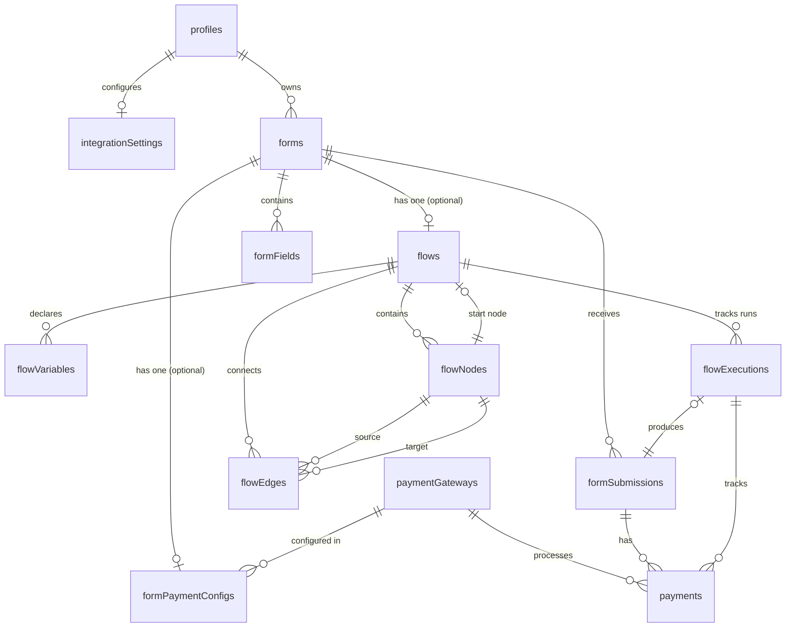

# Flow Builder — Knowledge Base

> **Complete reference for the PonkoForm Flow Builder.** Covers everything from node types and variables to the runtime engine and database schema.
> Verified against `main` at `7d2cbe3` on 2026-07-28.

---

## Table of Contents

### User Reference (for form creators)

1. [Node Types Reference](#1-node-types-reference)
2. [Variables System](#2-variables-system)
3. [Expression & Calculator Guide](#3-expression-calculator-guide)
4. [Payment Flows](#4-payment-flows)
5. [Flow Validation](#5-flow-validation)
6. [Testing with Preview](#6-testing-with-preview)
7. [Publishing & Respondent Experience](#7-publishing-respondent-experience)
8. [Creating or Migrating a Flow](#8-creating-or-migrating-a-flow)

### Developer Reference (data model & architecture)

9. [Database Schema](#9-database-schema)
10. [Type System](#10-type-system)
11. [Runtime Engine Architecture](#11-runtime-engine-architecture)
12. [Server Functions API](#12-server-functions-api)
13. [UI Component Tree](#13-ui-component-tree)
14. [Routes & Navigation](#14-routes-navigation)
15. [Validation Rules Reference](#15-validation-rules-reference)
16. [Backward Compatibility](#16-backward-compatibility)

---

# User Reference

## 1. Node Types Reference

Each node type has a specific purpose, configuration fields, and behavior when executed.

### 1.1 Start ▶️

**The entry point — every flow must have exactly one.**

| Property | Value |
|---|---|
| **Purpose** | Marks the beginning of the flow |
| **Configuration** | None |
| **Edges** | Exactly 1 outgoing |
| **Created** | Automatically when a flow is created |
| **UI** | Rounded shape, green accent |

### 1.2 Form Field ☐

**Collects input from the respondent — text, numbers, choices, etc.**

| Field | Required | Description |
|---|---|---|
| `fieldType` | ✅ | One of: `text`, `email`, `number`, `textarea`, `select`, `checkbox`, `radio` |
| `label` | ✅ | The question or prompt shown to the respondent |
| `placeholder` | — | Hint text inside the field (text/email/number/textarea only) |
| `required` | — | Whether the respondent must fill this field |
| `options` | Depends | Array of `{ label, value }` — required for `select`/`checkbox`/`radio` |
| `bindToVariable` | ✅ | The variable where the answer will be stored |

**Example config (a select field):**
```
fieldType: select
label: "Choose your plan"
required: true
options: [
  { label: "Full Payment", value: "full" },
  { label: "Installment", value: "installment" }
]
bindToVariable: "payment_plan"
```

### 1.3 Group 📋

**Collects multiple related fields on a single step.** Useful for address blocks, service selection catalogs, or multi-field input.

| Field | Required | Description |
|---|---|---|
| `title` | — | Heading shown above the group |
| `fields` | ✅ | Array of field definitions (each with `id`, `label`, `fieldType`, `required`, `options`, `bindToVariable`) |

**Example:** An address group with street, city, and zip fields on one page.

### 1.4 Decision ◇

**Branches the flow based on a respondent's answer.** Routes to different paths depending on what value a variable holds.

| Field | Required | Description |
|---|---|---|
| `sourceVariable` | ✅ | The variable to check (must be a `string` or `boolean` variable) |
| `branches` | ✅ | Array of `{ value, label }` — each value must match the edge's `matchValue` |

**How it works:**
1. The respondent selects an option on a prior form field
2. That answer is stored in the `sourceVariable`
3. The decision node checks the variable's value
4. The runtime follows the edge whose `matchValue` matches the value

**Example:** A "Payment Plan?" decision with branches for `full` and `installment`.

> **Behavior when no branch matches:** The runtime follows the first outgoing edge as the default. Connect edges in order of priority.

### 1.5 Calculator ∑

**Runs a math expression and stores the result in a variable.** Calculators execute automatically — the respondent never sees them.

| Field | Required | Description |
|---|---|---|
| `targetVariable` | ✅ | The variable to store the result into (must be `number` or `money` type) |
| `expression` | ✅ | A math expression using variables (e.g., `{{subtotal}} * 1.12`) |
| `label` | — | A human-readable label shown in the flow graph for context |

**Key behavior:**
- Executes immediately when the respondent reaches this node
- Auto-advances to the next node (no user interaction)
- Can read variables set by earlier form fields or calculators
- Store results in variables that later nodes can read

**Example:** `round(({{subtotal}} * 1.12) / 6, 2)` — adds 12% VAT and divides by 6, rounded to 2 decimals.

### 1.6 Payment $

**Charges the respondent via a connected payment gateway.**

| Field | Required | Description |
|---|---|---|
| `amountVariable` | ✅ | A `money` variable holding the amount to charge |
| `currency` | ✅ | Three-letter currency code (e.g., `PHP`, `USD`) |

**How it works:**
1. The amount variable must be set by a **Calculator** before this node
2. The respondent sees the amount and chooses a payment method
3. They're redirected to the gateway's checkout page
4. On return, the flow continues along the **success** edge (first edge) or **failure** edge (optional second edge)

### 1.7 Summary ≡

**Shows a confirmation or receipt page — terminal node (flow ends here).**

| Field | Required | Description |
|---|---|---|
| `title` | — | Heading text (e.g., "Order Confirmation") |
| `template` | — | Message with `{{variable}}` placeholders that get replaced with actual values |

**Example template:**
```
Thank you {{full_name}}! Your {{payment_plan}} plan is confirmed.
Amount: {{amount_due}}
Reference: {{payment_ref}}
```

### 1.8 Redirect ↗

**Sends the respondent to an external URL — terminal node (flow ends here).**

| Field | Required | Description |
|---|---|---|
| `urlTemplate` | ✅ | A URL with `{{variable}}` placeholders |

**Example:** `https://example.com/access?ref={{payment_ref}}&name={{full_name}}`

The redirect happens after a ~1.5 second pause so the respondent sees a brief "Redirecting..." message.

---

## 2. Variables System

### 2.1 Variable Properties

| Property | Description |
|---|---|
| **Name** | Unique `snake_case` identifier (e.g., `total_cost`, `payment_plan`) |
| **Type** | `string`, `number`, `boolean`, `money`, `date`, `time`, or `datetime` |
| **Default Value** | Optional — used if the variable is read before being assigned |
| **Description** | Optional human-readable note for documentation |

### 2.2 Variable Lifecycle

```
  Declare ──→ Assign ──→ Transform ──→ Use
```

1. **Declare:** Create the variable in the Variables Manager
2. **Assign:** A form field stores the respondent's answer into the variable
3. **Transform:** A calculator reads the variable, computes a new value, and stores it (possibly into a different variable)
4. **Use:** A decision, payment, summary, or redirect reads the variable

### 2.3 Type Behaviors

| Type | Display Format | How to Set | How to Read |
|---|---|---|---|
| `string` | Raw text | Form field binds to variable | `{{variable_name}}` in templates/expressions |
| `number` | `1,234.56` | Calculator computes, or form field stores number | `{{variable_name}}` in expressions |
| `money` | `1,234.00` with the template/node currency context | Calculator uses major units (`1500` = ₱1,500.00) | Payment boundary converts to integer minor units |
| `boolean` | `true` / `false` | Checkbox or decision automatically | Conditionals: `if({{var}}, 1, 0)` |

### 2.4 Best Practices

- **Declare before using:** Create the variable before binding a form field or calculator to it
- **Money uses major units in flows:** Use `1500` for ₱1,500.00 and round calculated results to two decimals. Persisted payment rows store `150000` centavos.
- **Descriptive names:** Use `total_cost`, not `tc`
- **Defaults for testing:** Set a default value for the first variable in a calculation chain so Preview mode works without filling every field

---

## 3. Expression & Calculator Guide

### 3.1 Syntax

Calculators support standard arithmetic with variables referenced as `{{variable_name}}`:

```
{{subtotal}} * 1.12          → add 12% VAT
({{price}} + {{shipping}})    → parentheses for grouping
round({{total}} / 6, 2)      → divide and round
if({{age}} >= 18, 1, 0)       → numeric conditional
contains({{items}}, 'premium') → string contains check
```

### 3.2 Built-in Functions

| Function | Signature | Description | Example |
|---|---|---|---|
| `round` | `round(value, decimals?)` | Rounds to N decimal places | `round({{total}} / 6, 2)` |
| `if` | `if(condition, trueVal, falseVal)` | Conditional numeric selection | `if({{age}} >= 18, 1, 0)` |
| `contains` | `contains(str, substr)` | String contains check | `contains({{items}}, 'premium')` |

### 3.3 Common Expressions

| Goal | Expression |
|---|---|
| Subtotal × quantity | `{{qty}} * {{unit_price}}` |
| Add 12% VAT | `{{subtotal}} * 1.12` |
| Apply 10% discount | `{{total}} * 0.9` |
| Monthly payment (6 months) | `round({{total}} / 6, 2)` |
| Conditional discount | `if(equalText({{member_status}}, 'yes'), {{total}} * 0.85, {{total}})` |
| Total with fee + deposit | `{{fee_total}} + {{vat}} + {{deposit_total}}` |
| Nested tier pricing | `if(equalText({{tier}}, 'gold'), 100, if(equalText({{tier}}, 'silver'), 50, 25))` |

### 3.4 Testing Expressions

Each Calculator config panel has a built-in **expression tester**. Plug in sample values and see the result instantly — no need to run through the full flow to verify math.

---

## 4. Payment Flows

See the dedicated [Payments Guide](payments-guide.md) for the complete walkthrough. Quick reference:

### Payment Node Requirements

1. **Gateway connected** — PayPal or Xendit credentials in Settings
2. **Amount variable** — a `money` variable set by a calculator before the payment node
3. **Currency** — must be supported by the connected gateway

### Payment Flow Pattern

```
... → [Calculator: compute amount_due] → [Payment: Charge] → [Summary: Receipt]
                                                          └→ [Summary: Failed]
```

### Transaction Tracking

Every payment is recorded in the database and viewable from the **Payments** tab in the form editor. See [Payments Guide](payments-guide.md#step-4-view-payment-transactions) for details.

---

## 5. Flow Validation

Before a flow can be saved or published, it must pass validation. The system checks for:

### Structural Rules

| Rule | Fail Condition |
|---|---|
| Exactly one Start node | 0 or 2+ Start nodes |
| At least one terminal node | No Summary or Redirect node |
| All nodes connected | A node with no incoming or outgoing edge |
| No orphan nodes | A node not reachable from Start |
| Decision branches match edges | Mismatch between branch count and edge count |

### Configuration Rules

| Rule | Fail Condition |
|---|---|
| Form field has a bindToVariable | Missing or empty |
| Calculator has an expression | Missing or empty |
| Calculator target variable exists | Target variable not declared |
| Payment amount variable exists | Amount variable not declared |
| Redirect has a URL | urlTemplate is empty |

### 5.1 Running Validation

Click **Validate** in the toolbar (✓ icon). Errors are shown as a list and as red indicators on the affected nodes. A flow with errors cannot be published.

---

## 6. Testing with Preview

### How Preview Works

The Preview dialog runs the flow **entirely client-side** — it uses the same FlowEngine that runs the real form, but without server persistence. This means:

- You can test without publishing
- Calculator results are instant
- Payment nodes are **simulated** (no real charge)
- "Skip required fields" checkbox lets you quickly jump through steps

### Preview Controls

| Control | What It Does |
|---|---|
| **Next** | Advance to the next step (with current input) |
| **Back** | Go to the previous step (clears inputs) |
| **Skip required** | Bypasses field validation — lets you speed through |
| **Close** | Exits preview (state is discarded) |

### Testing Checklist

- [ ] Walk through every path (try each branch of each Decision)
- [ ] Verify Calculator results against a manual computation
- [ ] Check the Summary template renders correctly
- [ ] Test edge cases: empty fields, extreme numbers, all options selected

---

## 7. Publishing & Respondent Experience

### 7.1 Publishing

Click **Publish** in the form editor to make the form available to respondents. Once published:

- The form receives a public URL: `/forms/submit/{formId}`
- The embed code becomes available for embedding in external sites
- Changes require re-publishing to take effect

### 7.2 Step-by-Step Runtime

When a respondent opens a published flow form:

1. The form loads with a clean entry point
2. **Start** node initializes variables with default values
3. Each node executes in order, controlled by the client-side FlowEngine
4. Field nodes show inputs, calculator nodes run automatically
5. Decision nodes branch based on answers
6. Payment nodes redirect to the gateway
7. Terminal nodes show a receipt or redirect
8. On completion, the execution is saved as a **form submission** with all variable values

### 7.3 Completion Receipt

After the flow finishes, the respondent sees a receipt page showing:

- **Success/failure** banner
- **Invoice-style receipt** with form title, invoice number, date
- **All variable values** formatted by type (money shows with currency)
- **Payment info:** status, gateway name, gateway reference
- **Download as PDF** button

### 7.4 Data Storage

Each completed flow run creates two database records:

1. **`flow_executions`** — tracks the entire run: which nodes were visited, current/previous state, variable values at each step
2. **`form_submissions`** — the final submission record with all variable values stored in `form_data`

---

## 8. Creating or Migrating a Flow

New forms currently start as page forms. The unified editor does not expose a creator-facing **Convert to Flow** action.

The owner-gated `ensureFlow({ formId })` server function remains available to create a flow from legacy `form_fields`, or a blank Start → Summary graph when no legacy fields exist. Use it only from an intentional migration or future product workflow; adding a `flows` row changes which public runtime the form uses.

Before migrating a live form:

1. Decide how page fields, conditions, computation, and payments map to flow nodes and variables.
2. Preserve the form's public ID so the share URL stays stable.
3. Validate the generated DAG and test both payment/decision branches.
4. Confirm how historical response columns will be presented beside new flow submissions.

---

# Developer Reference

## 9. Database Schema

### 9.1 Entity Relationship



### 9.2 Key Tables

#### `forms`

| Column | Type | Notes |
|---|---|---|
| `id` | `serial` PK | |
| `profile_id` | `integer` FK → profiles | Owner |
| `title` | `varchar(255)` | |
| `status` | `enum` | `draft` or `published` |
| `theme` | `jsonb` | Per-form styling: `{ primaryColor, backgroundColor, radius }` |

#### `flows`

| Column | Type | Notes |
|---|---|---|
| `id` | `serial` PK | |
| `form_id` | `integer` FK → forms (CASCADE) | One flow per form |
| `start_node_id` | `integer` FK → flow_nodes | Set after node creation |

#### `flow_nodes`

| Column | Type | Notes |
|---|---|---|
| `id` | `serial` PK | |
| `flow_id` | `integer` FK → flows (CASCADE) | |
| `type` | `varchar(30)` | `start`, `form_field`, `group`, `decision`, `calculator`, `payment`, `summary`, `redirect` |
| `label` | `varchar(255)` | Display label |
| `config` | `jsonb` | Type-specific config (see below) |
| `positionX/Y` | `integer` | Canvas position |

#### `flow_edges`

| Column | Type | Notes |
|---|---|---|
| `id` | `serial` PK | |
| `flow_id` | `integer` FK → flows (CASCADE) | |
| `source_node_id` | `integer` FK → flow_nodes (CASCADE) | |
| `target_node_id` | `integer` FK → flow_nodes (CASCADE) | |
| `metadata` | `jsonb` | `{ matchValue?, label? }` for decision branches |

#### `flow_variables`

| Column | Type | Notes |
|---|---|---|
| `id` | `serial` PK | |
| `flow_id` | `integer` FK → flows (CASCADE) | |
| `name` | `varchar(100)` | `snake_case` identifier |
| `type` | `varchar(20)` | `string`, `number`, `boolean`, `money` |
| `default_value` | `text` | Parsed by type |
| UNIQUE | `(flow_id, name)` | |

#### `flow_executions`

| Column | Type | Notes |
|---|---|---|
| `id` | `serial` PK | |
| `flow_id` | `integer` FK → flows (CASCADE) | |
| `form_submission_id` | `integer` FK → form_submissions (SET NULL) | Backfilled at completion |
| `status` | `varchar(20)` | `in_progress`, `payment_pending`, `payment_failed`, `completed`, `cancelled` |
| `current_node_id` | `integer` FK → flow_nodes | |
| `variables` | `jsonb` | Live variable values |
| `history` | `jsonb` | Array of `{ nodeId, nodeType, enteredAt, data? }` |

#### `payments`

| Column | Type | Notes |
|---|---|---|
| `id` | `serial` PK | |
| `form_submission_id` | `integer` FK → form_submissions (SET NULL) | |
| `payment_gateway_id` | `integer` FK → payment_gateways | |
| `flow_execution_id` | `integer` FK → flow_executions (SET NULL) | |
| `amount` | `integer` | In smallest currency unit |
| `currency` | `varchar(3)` | |
| `status` | `enum` | `pending`, `completed`, `failed`, `refunded` |
| `gateway_payment_id` | `text` | Gateway's reference |

### 9.3 Config Shapes by Node Type

```jsonc
// form_field
{
  "fieldType": "text|email|number|textarea|select|checkbox|radio",
  "label": "Field Label",
  "placeholder": "Optional",
  "required": true,
  "options": [{"label": "Option 1", "value": "opt1"}],
  "bindToVariable": "variable_name"
}

// group
{
  "title": "Section Title",
  "fields": [{ "id": "uid", "label": "Field 1", "fieldType": "text", "required": true, "options": [] }]
}

// decision
{
  "sourceVariable": "variable_name",
  "branches": [{"value": "option", "label": "Display Label"}]
}

// calculator
{
  "targetVariable": "result_var",
  "expression": "{{var1}} * 1.12",
  "label": "Human label"
}

// payment
{
  "amountVariable": "total_cost",
  "currency": "PHP"
}

// summary
{
  "title": "Thank You",
  "template": "Your total is {{total_cost}}"
}

// redirect
{
  "urlTemplate": "https://example.com/ref={{payment_ref}}"
}
```

---

## 10. Type System

```typescript
type FlowNodeType = 'start' | 'form_field' | 'group' | 'decision'
  | 'calculator' | 'payment' | 'summary' | 'redirect'

type FlowVariableType =
  | 'string' | 'number' | 'boolean' | 'money'
  | 'date' | 'time' | 'datetime'

type ExecutionStatus = 'in_progress' | 'payment_pending'
  | 'payment_failed' | 'completed' | 'cancelled'

type PaymentStatus = 'pending' | 'completed' | 'failed' | 'refunded'

interface FlowNode {
  id: number
  flowId: number
  type: FlowNodeType
  label: string | null
  config: Record<string, unknown>
  positionX: number
  positionY: number
}

interface FlowEdge {
  id: number
  flowId: number
  sourceNodeId: number
  targetNodeId: number
  metadata: { matchValue?: string; label?: string }
}

interface FlowVariable {
  id: number
  flowId: number
  name: string
  type: FlowVariableType
  defaultValue: string | null
  description: string | null
}

interface FlowStep {
  nodeId: number
  nodeType: string
  config: Record<string, unknown>
  label: string
  expectsInput: boolean
  isPayment: boolean
  isTerminal: boolean
  renderedOutput?: string
  redirectUrl?: string
}

interface StepInput {
  formValue?: unknown
  decisionValue?: string
  groupValues?: Record<string, unknown>
  paymentResult?: { success: boolean; gatewayPaymentId?: string }
}
```

---

## 11. Runtime Engine Architecture

### 11.1 FlowEngine (`src/lib/flow-engine/FlowEngine.ts`)

The FlowEngine is a **client-side runtime** that walks through the flow graph one node at a time. It manages:

- **Current position** — which node is active
- **Variable values** — the runtime state of all variables
- **History** — the path the respondent has taken (for "back" navigation and final submission)
- **Status** — whether the flow is in progress, complete, or waiting for payment

**Lifecycle:**

```
1. Constructor(nodes, edges, variables, initialValues)
   → Builds adjacency maps, sets current node to Start

2. advance(input?)
   → Moves to the next node based on current type
   → For calculators: evaluates expression, stores result, auto-advances
   → For decisions: follows the edge matching input.decisionValue
   → For payment: follows success/failure edge based on input.paymentResult

3. goBack()
   → Returns to the previous node (reverse of advance)

4. getCurrentStep()
   → Returns the FlowStep for the current node (what the UI renders)

5. getSnapshot()
   → Returns { currentNodeId, variables, history, status } for persistence

6. restore(nodes, edges, variables, snapshot)
   → Static method — rebuilds an engine from a saved snapshot
   → Used when resuming after a payment redirect
```

### 11.2 ExpressionEvaluator (`src/lib/flow-engine/ExpressionEvaluator.ts`)

Resolves `{{variable}}` placeholders and evaluates the AST produced by `safe-expression.ts`. It never executes JavaScript and supports:

- Variable substitution: `{{var_name}}` → actual value
- Arithmetic/comparison/logical operators documented in the user reference
- `if`, `contains`, `round`, `sum`, `min`, `max`, `abs`, and `equalText`
- Complexity limits and a finite-number result requirement

### 11.3 TemplateInterpolator (`src/lib/flow-engine/TemplateInterpolator.ts`)

Renders summary templates by replacing `{{variable}}` placeholders with formatted values:

- `money` types: formatted with currency (e.g., `₱1,500.00`)
- `number` types: formatted with locale separators
- `string` / `boolean`: raw text

### 11.4 FlowValidator (`src/lib/flow-engine/FlowValidator.ts`)

Checks a flow definition for structural and configuration errors. Called before save and publish.

---

## 12. Server Functions API

All server functions live in `src/lib/server-fns/` and are exposed as `createServerFn` (TanStack Start). Each requires authentication unless noted.

### 12.1 Flow CRUD (`flows.ts`)

| Function | Method | Input | Description |
|---|---|---|---|
| `getFlow` | GET | `{ formId }` | Fetch flow + nodes + edges + variables |
| `ensureFlow` | POST | `{ formId }` | Create a default flow if none exists |

### 12.2 Node & Edge CRUD (`flow-nodes.ts`)

| Function | Description |
|---|---|
| `addFlowNode` | Insert a new node (type, position, flowId) |
| `updateFlowNode` | Update a node's config and label |
| `deleteFlowNode` | Remove a node (cascade deletes edges) |
| `addFlowEdge` | Insert a new edge |
| `deleteFlowEdge` | Remove an edge |
| `saveFlowLayout` | Batch update node positions (for auto-layout) |
| `insertNodeInPath` | Insert a node between two connected nodes |
| `removeNodeFromPath` | Remove a node and reconnect its neighbors |
| `reorderPath` | Reorder the primary path (List view) |
| `moveFieldIntoGroup` | Move a form_field node into a Group node |

### 12.3 Variables CRUD (`flow-variables.ts`)

| Function | Description |
|---|---|
| `createFlowVariable` | Declare a new variable |
| `updateFlowVariable` | Change name, type, default, or description |
| `deleteFlowVariable` | Remove a variable |

### 12.4 Flow Execution (`flow-executions.ts`)

Public endpoints (no auth — called by respondents):

| Function | Method | Input | Description |
|---|---|---|---|
| `startFlowExecution` | POST | `{ flowId, clientToken }` | Create a published-flow execution with defaults |
| `advanceExecution` | POST | `{ executionId, clientToken, currentNodeId, variables, history }` | Persist an owned snapshot |
| `completeExecution` | POST | `{ executionId, clientToken, variables, history }` | Complete and create/update the submission |
| `getCompletionData` | GET | `{ executionId, clientToken }` | Fetch owned receipt data |
| `getExecutionState` | GET | `{ executionId, clientToken }` | Refresh/resume an owned execution |

### 12.5 Payments (`payments.ts`)

| Function | Method | Input | Description |
|---|---|---|---|
| `getPaymentOptions` | GET | `{ executionId, clientToken }` | Compatible connected gateways + amount |
| `initiatePayment` | POST | `{ executionId, clientToken, gatewaySlug }` | Create checkout and a pending payment |
| `finalizePayment` | POST | `{ executionId, clientToken }` | Reconcile payment on return |
| `getResumeData` | GET | `{ executionId, clientToken }` | Owned execution + flow definition for restore |
| `getFormPayments` | GET | `{ formId, ...query }` | Authenticated paginated payment view (`payments-view.ts`) |

### 12.6 Submissions (`submissions.ts`)

| Function | Method | Input | Description |
|---|---|---|---|
| `submitFormResponse` | POST | `{ formId, formData, ... }` | Legacy flat-form submission boundary |
| `getSubmissions` | GET | `{ formId, ...query }` | Paginated creator response view |

---

## 13. UI Component Tree

### 13.1 Flow Builder (`src/components/flow-builder/`)

| Component | Purpose |
|---|---|
| `FlowCanvas.tsx` | React Flow canvas — renders nodes and edges visually |
| `FlowListBuilder.tsx` | Linear list view of the primary path |
| `BuilderPalette.tsx` | Left sidebar — drag/click to add nodes |
| `FlowPalette.tsx` | Legacy palette (superseded by BuilderPalette) |
| `NodeConfigPanel.tsx` | Right panel — configuration for the selected node |
| `VariablesManager.tsx` | Variables dialog — declare, edit, delete variables |
| `VariableDialog.tsx` | Create/edit a single variable |
| `FlowToolbar.tsx` | Top toolbar — View toggle, Validate, Preview, Variables |
| `SettingsDialog.tsx` | Form settings (title, description, theme) |
| `config-forms/` | Per-node-type config forms (FormField, Decision, Calculator, Payment, etc.) |
| `nodes/` | Custom React Flow node renderers |

### 13.2 Flow Execution (`src/components/flow-execution/`)

| Component | Purpose |
|---|---|
| `FlowExecutionContainer.tsx` | Parent — drives engine, manages state, handles resume |
| `FlowStepRenderer.tsx` | Renders the current step (form field, payment, summary, etc.) |
| `PaymentStep.tsx` | Inline payment UI — amount display, gateway selection, pay button |
| `InvoiceUtils.ts` | Pure invoice model and formatting helpers |
| `InvoicePDF.ts` | jsPDF-based PDF generation |
| `InvoiceDownloadButton.tsx` | Respondent PDF download action |

### 13.3 Shared UI (`src/components/ui/`)

| Component | Purpose |
|---|---|
| `Button.tsx` | Primary/secondary button |
| `Badge.tsx` | Status badge (draft/published/paid/pending/failed/refunded) |
| `Card.tsx` | Content card |
| `FlowPreviewModal.tsx` | Preview dialog |
| `PreviewDialog.tsx` | Dialog wrapper for preview |

---

## 14. Routes & Navigation

### Form Creator Routes (auth required)

| Route | Component | Purpose |
|---|---|---|
| `/dashboard` | `DashboardPage` | Form list |
| `/forms/new` | `NewFormPage` | Create form |
| `/forms/$formId/edit` | `UnifiedEditorPage` | Page Builder or Flow List/Canvas |
| `/forms/$formId/submissions` | `SubmissionsPage` | Response list with payment status |
| `/forms/$formId/payments` | `PaymentsPage` | Payment transactions table |
| `/forms/$formId/invoicing` | Invoicing route | Email templates and delivery history |
| `/settings/integrations` | Integrations route | Provider credentials and status |

### Public Routes (no auth)

| Route | Component | Purpose |
|---|---|---|
| `/forms/submit/$publicId` | `PublicFormView` | Public form submission |
| `/forms/embed/$publicId` | `EmbedFormPage` | Embedded form (transparent) |
| `/forms/payment-return` | `PaymentReturnPage` | Gateway redirect handler (resume after payment) |
| `/flow/$executionId/complete` | `CompletePage` | Token-protected flow receipt |

---

## 15. Validation Rules Reference

| Rule | Check | Error Message |
|---|---|---|
| Start | At least one Start exists; Start has exactly one outgoing edge | Missing/config error |
| Connectivity | Every non-Start node reachable from Start | Node-specific reachability error |
| Cycles | Graph must be a DAG | Cycle error |
| Decision branches | Outgoing connections ≥ configured branches | Node-specific connection error |
| FormField/Group binding | Any configured binding names a declared variable | Undeclared-variable error |
| Calculator | Target exists and expression is present | Node-specific configuration error |
| Payment | Amount variable exists; 1–2 outgoing edges | Node-specific configuration error |
| Summary/Redirect | Required content is present; 0 outgoing edges | Node-specific configuration error |

---

## 16. Backward Compatibility

### 16.1 Form Type Detection

`PublicFormView` selects flow versus page runtime from the loaded public form:

```typescript
const [flow] = await db.select().from(flows).where(eq(flows.formId, formId)).limit(1)
if (flow) {
  // Render FlowExecutionContainer
} else {
  // Render PageFormView
}
```

### 16.2 Page/Legacy → Flow Migration

`ensureFlow` can build Start → FormField nodes → Summary from legacy `form_fields`. There is no current Page Builder conversion UI, and page-specific conditions/computation do not automatically map through this legacy helper.

### 16.3 Existing Submissions

Historical submissions remain in `form_submissions`. Response-column helpers combine page, flow, and legacy sources so mixed history can still be presented.

---

> **Need more help?** Check the [Flow Form Guide](flow-form-guide.md) for tutorials, the [Payments Guide](payments-guide.md) for payment setup, or the [system memory](../memory-ponko/README.md) for the full architecture overview.
