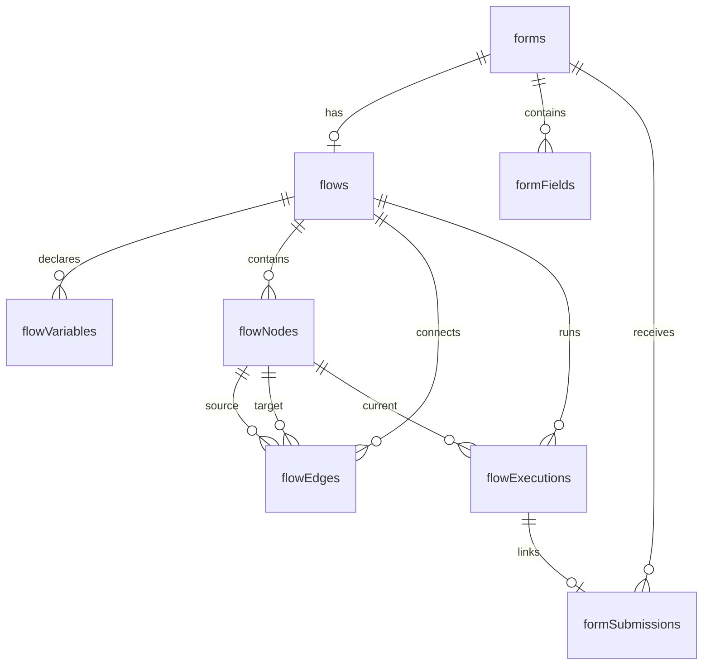

# Flow Builder — Knowledge Base

> **Feature:** FT001 Flow Builder
> **Status:** Implemented ✅
> **Tech Stack:** TanStack Start, Drizzle ORM (Neon/Postgres), React Flow, math.js, Clerk Auth
> **Source:** `features/FT001-flow-builder/` (plan, spec, requirements, discussion)

The Flow Builder transforms PonkoForm from a **linear form builder** into a **visual workflow engine**. Form creators compose multi-step, branching, calculator-enabled, payment-integrated flows by connecting nodes on a canvas — no code required.

A form with a flow runs the step-by-step flow experience for respondents. A form *without* a flow behaves exactly as before (the classic single-page linear form), so existing forms are unaffected.

---

## Table of Contents

### User Documentation (for form creators)
1. [Quick Start](#1-quick-start)
2. [Concepts](#2-concepts)
3. [Node Types Reference](#3-node-types-reference)
4. [Variables System](#4-variables-system)
5. [Expression & Calculator Guide](#5-expression--calculator-guide)
6. [Payment Flows](#6-payment-flows)
7. [Flow Validation](#7-flow-validation)
8. [Testing with Preview](#8-testing-with-preview)
9. [Publishing & Respondent Experience](#9-publishing--respondent-experience)
10. [Converting a Linear Form](#10-converting-a-linear-form)

### Developer Documentation (data model & architecture)
11. [Database Schema](#11-database-schema)
12. [Type System](#12-type-system)
13. [Runtime Engine Architecture](#13-runtime-engine-architecture)
14. [Server Functions API](#14-server-functions-api)
15. [UI Component Tree](#15-ui-component-tree)
16. [Routes & Navigation](#16-routes--navigation)
17. [Validation Rules (Reference)](#17-validation-rules-reference)
18. [Backward Compatibility](#18-backward-compatibility)

---

## 1. Quick Start

### Creating a New Flow

1. **Create a form** — from the dashboard, click **New Form**, give it a title, and select **Flow Builder** as the mode.
2. **Create the flow** — you'll land on the Flow Builder page. Click **Create Flow** to add the initial Start node.
3. **Add nodes** — drag node types from the left palette onto the canvas, or click to add at a default position.
4. **Connect nodes** — drag from a node's bottom handle (`●`) to another node's top handle (`●`).
5. **Configure each node** — click a node to open its configuration panel on the right.
6. **Declare variables** — open the **Variables** manager from the toolbar to declare typed variables.
7. **Test** — click **Preview** to step through the flow in a dialog before publishing.
8. **Publish** — switch to the **Edit** tab and click **Publish** to make the form live.

### Converting an Existing Form

On the dashboard, forms without a flow show a **Convert to Flow** option in the actions menu (three-dot icon). Converting creates a linear flow from your existing fields — you can then add decisions, calculators, and payments.

---

## 2. Concepts

### Flow
One per form. A flow is a directed acyclic graph (DAG) of nodes. Created from the form's **Flow** tab, or by converting an existing linear form.

### Nodes
The steps in the workflow. There are 7 node types: Start, Form Field, Decision, Calculator, Payment, Summary, and Redirect.

### Edges
Directed connections between nodes that define the execution path. Edges for Decision nodes carry a `matchValue` that determines which branch to follow based on the respondent's selection.

### Variables
Typed values shared across all nodes in a flow. Form fields store answers in them, calculators transform them, and payments, summaries, and redirects read them.

### Execution
When a respondent submits a flow-powered form, a runtime engine runs the flow step by step — showing one field at a time, evaluating decisions, computing calculators, and handling payment.

### Terminal Nodes
**Summary** and **Redirect** are terminal — they end the flow and have no outgoing connections. Summary shows a dynamic receipt page; Redirect sends the user to an external URL.

---

## 3. Node Types Reference

Each node type has a specific purpose, configuration schema, and edge constraints.

### 3.1 Start ▶️
- **Purpose:** Entry point of every flow. Exactly one per flow.
- **Configuration:** None.
- **Edges:** Exactly 1 outgoing.
- **Created:** Automatically when the flow is created.
- **UI:** Round shape, green accent, no target handle.

### 3.2 Form Field ☐
- **Purpose:** Collect input from the respondent (text, email, number, textarea, select, checkbox, radio).
- **Configuration:**
  - `fieldType` — one of: `text`, `email`, `number`, `textarea`, `select`, `checkbox`, `radio`
  - `label` — the field label shown to the respondent
  - `placeholder` — placeholder text (text/email/number/textarea only)
  - `required` — whether the field must be filled
  - `options` — array of `{ label, value }` (select/checkbox/radio only)
  - `bindToVariable` — the variable name where the answer is stored
- **Edges:** Exactly 1 outgoing.
- **UI:** Rectangle, blue accent icon, shows field type detail.

### 3.3 Decision ◇
- **Purpose:** Branch the flow based on a variable's value.
- **Configuration:**
  - `sourceVariable` — the string variable to evaluate
  - `branches` — array of `{ value, label }` pairs
- **Edges:** One per branch. Each edge's `matchValue` metadata determines which branch fires.
- **Runtime behavior:** When the engine reaches a Decision node, it reads the source variable, finds the outgoing edge whose `matchValue` matches, and follows it. If no match is found, it follows the first edge as a default.
- **UI:** Diamond shape, amber accent, shows branch count.

### 3.4 Calculator ∑
- **Purpose:** Compute a value from an expression and store it in a variable.
- **Configuration:**
  - `targetVariable` — the variable (must be `number` or `money` type)
  - `expression` — a math formula using `{{variable}}` placeholders
- **Edges:** Exactly 1 outgoing.
- **Runtime behavior:** Automatically evaluated — the respondent never sees the calculator node. The result is stored in the target variable. Results targeting `money` variables are rounded to 2 decimal places.
- **UI:** Rectangle, purple accent, shows expression preview.

### 3.5 Payment $
- **Purpose:** Collect a real payment through the form owner's own gateway accounts (PayPal, Xendit).
- **Configuration:**
  - `amountVariable` — the `money`/`number` variable holding the amount to charge
  - `currency` — e.g., USD, PHP, EUR
  - (No gateway is chosen on the node — the visitor picks at checkout from the methods you connected in **Settings**.)
- **Edges:** 1 (success path) or 2 (success + failure). The first edge is the success path; the second (optional) is the failure path.
- **Runtime behavior:** Shows the amount and a button per connected gateway. On click, the server creates the order/invoice with your credentials and redirects the visitor to the gateway's hosted checkout; on return the charge is verified and the flow advances onto the success or failure edge. The verified gateway reference is available as `{{payment_ref}}`.
- **UI:** Rectangle, green accent, shows amount variable.

### 3.6 Summary ≡
- **Purpose:** Show a dynamic result/receipt page to the respondent. Terminal node.
- **Configuration:**
  - `title` — heading text (e.g., "Thank you!")
  - `template` — HTML/text with `{{variable}}` placeholders (e.g., "Your order total is {{total_cost}}")
- **Edges:** 0 (terminal — no outgoing connections).
- **Runtime behavior:** Renders the interpolated template, shows a success animation, and displays a receipt table of all variable values.
- **UI:** Rectangle, gray accent, shows template preview.

### 3.7 Redirect ↗
- **Purpose:** Send the respondent to an external URL. Terminal node.
- **Configuration:**
  - `urlTemplate` — URL with `{{variable}}` placeholders (e.g., `https://example.com/course?ref={{payment_ref}}`)
- **Edges:** 0 (terminal — no outgoing connections).
- **Runtime behavior:** Shows a brief "Redirecting…" message, then navigates to the constructed URL.
- **UI:** Rectangle, gray accent, shows URL preview.

---

## 4. Variables System

Variables are the data backbone of every flow. They are **typed, declared, and scoped** to a single flow.

### 4.1 Variable Properties

| Property | Description | Rules |
|---|---|---|
| `name` | Identifier used in expressions as `{{name}}` | Must be `snake_case` (lowercase letters, numbers, underscores; starting with a letter). Unique within a flow. |
| `type` | The kind of data stored | `string`, `number`, `boolean`, or `money` |
| `defaultValue` | Starting value when a flow run begins | Parsed by type at runtime |
| `description` | Human-readable note | Shown on the completion receipt page |

### 4.2 Type Behaviors

| Type | Default Parsing | Display Format | Calculator Target |
|---|---|---|---|
| `string` | As-is text | Raw text | No |
| `number` | `Number(value)` | Locale-formatted (e.g., `1,200`) | Yes |
| `boolean` | `value === 'true'` | `true` / `false` | No |
| `money` | `Number(value)` | `$1,200.00` (2 decimals, dollar sign) | Yes (auto-rounded to 2 decimals) |

### 4.3 Variable Lifecycle

1. **Declaration** — Creator declares a variable in the Variables Manager.
2. **Binding** — A Form Field node stores the respondent's answer into the variable via `bindToVariable`.
3. **Transformation** — A Calculator node reads one or more variables and writes the result to a target variable.
4. **Reading** — Decision nodes check variable values; Payment and Summary nodes display them.
5. **Persistence** — On completion, all variable values are saved into the `formSubmissions.formData` JSONB field.

### 4.4 Safety

A variable **cannot be deleted** while any node references it. The Variables Manager shows a "Used by N nodes" count and disables the delete button. References are checked across all config fields: `bindToVariable`, `sourceVariable`, `targetVariable`, `amountVariable`, and inside `expression`, `template`, and `urlTemplate` strings.

---

## 5. Expression & Calculator Guide

Calculator expressions use [math.js](https://mathjs.org) in a **sandboxed scope** — no access to `eval`, `Function`, `window`, `document`, or global objects. Only pure math operations and the allowed function set are available.

### 5.1 Syntax

```
VARIABLE_REF  = '{{' IDENTIFIER '}}'
IDENTIFIER    = [a-zA-Z_][a-zA-Z0-9_]*

Operators:  +  -  *  /  ^  ( )
Ternary:    condition ? value_if_true : value_if_false
```

> ⚠️ **String comparisons:** math.js `==` does **not** compare strings. Use `equalText(a, b)` for string equality, or better — route on string values with a **Decision** node rather than a calculator.

### 5.2 Built-in Functions

| Function | Purpose | Example |
|---|---|---|
| `round(x, decimals?)` | Round a number | `round({{total}}, 2)` |
| `sum(a, b, ...)` | Sum values | `sum({{price1}}, {{price2}})` |
| `min(a, b, ...)` | Minimum value | `min({{a}}, {{b}})` |
| `max(a, b, ...)` | Maximum value | `max({{a}}, {{b}})` |
| `abs(x)` | Absolute value | `abs({{difference}})` |
| `equalText(a, b)` | String comparison | `equalText({{plan}}, "full")` |

Plus the full math.js function set (trigonometric, logarithmic, statistical, etc.).

### 5.3 Real-World Examples

| Use Case | Variables | Expression |
|---|---|---|
| Add 12% VAT | `subtotal` (money) → `total_cost` (money) | `{{subtotal}} * 1.12` |
| 6-month installment | `subtotal` (money) → `monthly` (money) | `round({{subtotal}} * 1.12 / 6, 2)` |
| 10% discount | `price` (money) → `discounted` (money) | `{{price}} * 0.9` |
| Quantity-based price | `qty` (number), `unit_price` (money) → `line_total` (money) | `{{qty}} * {{unit_price}}` |
| Tiered pricing | `qty` (number) → `price` (money) | `{{qty}} > 10 ? 50 : 100` |
| String-based conditional | `plan` (string) → `amount` (money) | `equalText({{plan}}, "full") ? 1000 : 500` |

### 5.4 Testing Expressions

Every Calculator config has a **Test expression** button. It evaluates the current expression against the variables' default values and shows the result inline — green if successful, red with an error message if not.

---

## 6. Payment Flows

### 6.1 Setup Steps

1. **Connect a gateway** in **Settings** (`/dashboard/settings`): enter your own PayPal and/or
   Xendit credentials. They're encrypted at rest; each form charges through *your* accounts.
2. **Declare** a `money` variable for the amount (e.g., `total_cost`).
3. **Add a Calculator** (optional) to compute the amount from other variables.
4. **Add a Payment** node configured with:
   - **Amount variable** — the `money`/`number` variable holding the amount
   - **Currency** — e.g., USD, PHP, EUR
5. **Connect edges**:
   - First edge = **success path** (where the flow goes after payment)
   - Second edge (optional) = **failure path** (where it goes if payment fails)

At checkout the visitor sees a button for each method you connected and picks one — no gateway
is hard-coded on the node.

### 6.2 How it works at runtime

1. Visitor reaches the Payment step → picks PayPal or Xendit.
2. `initiatePayment` (server) reads the amount from the persisted execution, loads *your*
   decrypted credentials, creates the gateway order/invoice, and returns its hosted checkout URL.
3. The browser is redirected to the gateway; the visitor pays.
4. The gateway returns to `/forms/payment-return?executionId=…`; `finalizePayment` verifies the
   charge (PayPal captures the order, Xendit reads the invoice).
5. The flow resumes (`FlowEngine.restore`) and advances onto the success or failure edge.
   `{{payment_ref}}` holds the gateway's payment id.

A `payments` row records each attempt (linked to the flow execution). The amount and credentials
are always resolved server-side, so a visitor can't tamper with what they're charged.

> **Deployment:** set `APP_URL` to your deployed origin so return URLs are absolute. Webhook-based
> confirmation of late/asynchronous settlements is a planned follow-up; today confirmation happens
> on redirect-back.

### 6.3 Adding a new gateway

Implement the `PaymentGateway` abstract class (`createPayment`, `verifyPayment`, `getConfigSchema`)
and register it in `src/integrations/payments/index.ts`. Add its credential shape to
`src/lib/integrations/types.ts` + Settings, and a branch in `credentialsForSlug` /
`getPaymentOptions` (`src/lib/server-fns/payments.ts`).

---

## 7. Flow Validation

The Flow Builder validates continuously as you build. A count of issues appears in the toolbar. Open **Validate** to see the full list.

### 7.1 Validation Rules

| # | Rule | Error Type |
|---|---|---|
| 1 | Exactly one **Start** node must exist | `missing_start` |
| 2 | All nodes must be **reachable** from Start via edges | `disconnected` |
| 3 | No **cycles** — the flow must be a DAG | `cycle_detected` |
| 4 | Required config fields must be filled per node type | `missing_config` |
| 5 | All variable references (`bindToVariable`, `sourceVariable`, `targetVariable`, `amountVariable`) must point to declared variables | `missing_config` |
| 6 | Decision branches must be a subset of the source field's options (if bound to a select/radio field) | `type_mismatch` |
| 7 | Payment gateway must reference an active gateway | `missing_config` |
| 8 | Calculator expression must be syntactically valid | `missing_config` |
| 9 | Correct edge counts per node type (see Node Types Reference above) | `missing_config` |
| 10 | Terminal nodes (Summary, Redirect) must have **zero** outgoing edges | `missing_config` |

### 7.2 How Validation Works

- Validation runs whenever the flow definition changes (nodes, edges, or configs are saved).
- Issues appear as **red badges** on the affected nodes in the canvas.
- The toolbar shows a count: green "Valid ✓" or red "N issues".
- Click an issue in the validation panel to **jump to and select** the offending node.
- Nodes with validation issues show a red border and a numbered badge.

---

## 8. Testing with Preview

Click **Preview** in the toolbar to open a modal dialog that test-runs the flow entirely in the browser.

### What Preview Does

- **Instantiates** a client-side `FlowEngine` with the current flow data.
- **Steps through** each node — fields render as the respondent would see them.
- **Evaluates** decisions based on your selections.
- **Computes** calculators and shows results.
- **Simulates** payments (no real charge).
- **Shows** the final summary or redirect.

### Preview Controls

| Control | Action |
|---|---|
| **Continue / Begin** | Advance to the next step |
| **← Back** | Go back to the previous step |
| **Reset** | Restart the preview from the beginning |
| **Simulate success** | Simulate a successful payment |
| **Simulate failure** | Simulate a failed payment |
| **✕ Close** | Return to the builder |

> **No data is persisted** during Preview — no server calls, no execution records created.

---

## 9. Publishing & Respondent Experience

### 9.1 Publishing

Publish the form from the **Edit** tab as usual (the Publish button in the header). The form's status changes to `published`.

### 9.2 Respondent Flow Detection

When a respondent opens the public form URL (`/forms/submit/{formId}`):

1. The system checks if the form has a flow (`getFlow(formId)` returns non-null).
2. **Has flow** → Renders the step-by-step `FlowExecutionContainer`.
3. **No flow** → Renders the classic linear form (unchanged, backward compatible).

### 9.3 Step-by-Step Runtime

If the form has a flow, the respondent sees:

1. **Form step** — a single field (progress bar at top, Back/Continue buttons).
2. **Decision step** — radio buttons for each branch.
3. **Calculator step** — auto-advances (respondent doesn't see it).
4. **Payment step** — amount display + gateway payment button.
5. **Summary step** — success animation + interpolated template + variable details table.
6. **Redirect step** — brief "Redirecting…" then navigates to the constructed URL.

### 9.4 Completion Receipt

After completion, the respondent is directed to `/flow/{executionId}/complete` which shows:
- A success checkmark animation
- The Summary node's rendered template (if applicable)
- A receipt-style table of all variable values (money values formatted as `$1,200.00`)
- Payment reference ID (if applicable)
- A "Submit another response" button

### 9.5 Data Storage

Each completed flow run creates a `formSubmission` record containing:
- All variable values as `formData`
- The execution path (visited nodes) under `__executionPath`
- Payment reference IDs

This means flow responses appear in the existing **Responses** view like any other form submission.

---

## 10. Converting a Linear Form

Forms created before the Flow Builder (or created in "Builder" or "Plain" mode) can be **converted** to flows.

### Conversion Process

1. Click **Convert to Flow** from the dashboard actions menu.
2. A confirmation dialog explains what will happen.
3. On confirm, the system:
   - Creates a new `flow` record for the form
   - Creates a **Start** node
   - Creates one **Form Field** node per existing field (in order)
   - Creates one **variable** per field (snake_case name from the field label)
   - Binds each field to its variable via `bindToVariable`
   - Chains edges: Start → Field1 → Field2 → … → Last
   - Creates a **Summary** node at the end with a default template
4. You're redirected to the Flow Builder page to extend the flow.

### Important

- The original `formFields` table entries are **left untouched**.
- If the flow is deleted, the form reverts to **linear mode** — no data loss.
- Flow-powered forms still save responses to `formSubmissions`, so your existing Responses view works.

---

## 11. Database Schema

5 new tables were added to `src/db/schema.ts`. All follow existing project conventions: `serial()` primary keys, `pgTable` with indexes, `jsonb` for flexible config, `varchar` enums with `.$type<>()`.

### 11.1 Entity Relationship Diagram



### 11.2 Table: `flows`

Links a flow definition to a form. One flow per form (unique constraint).

| Column | Type | Constraints | Description |
|---|---|---|---|
| `id` | `serial` | PK | Auto-incrementing ID |
| `form_id` | `integer` | NOT NULL, UNIQUE, FK → forms.id, ON DELETE CASCADE | Parent form |
| `start_node_id` | `integer` | FK → flow_nodes.id | Reference to the Start node |
| `created_at` | `timestamp` | NOT NULL, DEFAULT now() | Creation timestamp |
| `updated_at` | `timestamp` | NOT NULL, DEFAULT now() | Last updated timestamp |

**Indexes:** `flows_form_id_idx` on `form_id`.

### 11.3 Table: `flow_variables`

Typed variable declarations scoped to a flow.

| Column | Type | Constraints | Description |
|---|---|---|---|
| `id` | `serial` | PK | Auto-incrementing ID |
| `flow_id` | `integer` | NOT NULL, FK → flows.id, ON DELETE CASCADE | Parent flow |
| `name` | `varchar(100)` | NOT NULL | snake_case identifier |
| `type` | `varchar(20)` | NOT NULL | `string` / `number` / `boolean` / `money` |
| `default_value` | `text` | | Stored as string, parsed by type at runtime |
| `description` | `text` | | Human-readable note |
| `created_at` | `timestamp` | NOT NULL, DEFAULT now() | Creation timestamp |

**Indexes:** `flow_variables_flow_id_name_idx` (UNIQUE) on `(flow_id, name)`.

### 11.4 Table: `flow_nodes`

Each node in the flow graph. The `config` JSONB column stores type-specific configuration (see Node Types Reference for per-type shapes).

| Column | Type | Constraints | Description |
|---|---|---|---|
| `id` | `serial` | PK | Auto-incrementing ID |
| `flow_id` | `integer` | NOT NULL, FK → flows.id, ON DELETE CASCADE | Parent flow |
| `type` | `varchar(30)` | NOT NULL | `start` / `form_field` / `decision` / `calculator` / `payment` / `summary` / `redirect` |
| `label` | `varchar(255)` | | Display label on the canvas |
| `config` | `jsonb` | NOT NULL, DEFAULT `{}` | Type-specific configuration |
| `position_x` | `integer` | NOT NULL, DEFAULT 0 | Canvas X position |
| `position_y` | `integer` | NOT NULL, DEFAULT 0 | Canvas Y position |
| `created_at` | `timestamp` | NOT NULL, DEFAULT now() | Creation timestamp |

**Indexes:** `flow_nodes_flow_id_idx` on `flow_id`.

**Config shapes by node type:**

```jsonc
// FormField
{ "fieldType": "text", "label": "Your Name", "placeholder": "e.g. Alice",
  "required": true, "options": [{"label":"A","value":"a"}],
  "bindToVariable": "customer_name" }

// Decision
{ "sourceVariable": "payment_plan",
  "branches": [{"value":"full","label":"Full Payment"}, {"value":"inst","label":"Installment"}] }

// Calculator
{ "targetVariable": "total_cost", "expression": "{{subtotal}} * 1.12" }

// Payment
{ "amountVariable": "total_cost", "currency": "USD", "gatewayId": 1 }

// Summary
{ "title": "Thank you!", "template": "Your total is {{total_cost}}. Reference: {{payment_ref}}" }

// Redirect
{ "urlTemplate": "https://example.com/course-access?ref={{payment_ref}}" }
```

### 11.5 Table: `flow_edges`

Directed connections between nodes. Decision edges carry a `matchValue` to indicate which branch they represent.

| Column | Type | Constraints | Description |
|---|---|---|---|
| `id` | `serial` | PK | Auto-incrementing ID |
| `flow_id` | `integer` | NOT NULL, FK → flows.id, ON DELETE CASCADE | Parent flow |
| `source_node_id` | `integer` | NOT NULL, FK → flow_nodes.id, ON DELETE CASCADE | Source (upstream) node |
| `target_node_id` | `integer` | NOT NULL, FK → flow_nodes.id, ON DELETE CASCADE | Target (downstream) node |
| `metadata` | `jsonb` | DEFAULT `{}` | `{ matchValue?: string, label?: string }` |
| `created_at` | `timestamp` | NOT NULL, DEFAULT now() | Creation timestamp |

**Indexes:** `flow_edges_flow_id_idx` on `flow_id`.

### 11.6 Table: `flow_executions`

Records a single run of a flow by an end user. Stores the entire execution context at completion.

| Column | Type | Constraints | Description |
|---|---|---|---|
| `id` | `serial` | PK | Auto-incrementing ID |
| `flow_id` | `integer` | NOT NULL, FK → flows.id, ON DELETE CASCADE | Parent flow |
| `form_submission_id` | `integer` | FK → form_submissions.id, ON DELETE SET NULL | Linked submission record |
| `status` | `varchar(20)` | NOT NULL, DEFAULT `in_progress` | `in_progress` / `completed` / `payment_pending` / `payment_failed` / `cancelled` |
| `current_node_id` | `integer` | FK → flow_nodes.id | Where the execution is paused (for resume) |
| `variables` | `jsonb` | DEFAULT `{}` | Snapshot of all variable values |
| `history` | `jsonb` | DEFAULT `[]` | `[{ nodeId, nodeType, enteredAt, data? }]` |
| `completed_at` | `timestamp` | | When the execution finished |
| `created_at` | `timestamp` | NOT NULL, DEFAULT now() | Creation timestamp |

**Indexes:** `flow_executions_flow_id_idx` on `flow_id`.

---

## 12. Type System

All core types are defined in `src/lib/flow-engine/types.ts`. These are shared between the Builder UI, the runtime engine, and the execution UI — no database or UI dependencies.

### 12.1 Node & Graph Types

```typescript
type FlowNodeType =
  | 'start' | 'form_field' | 'decision' | 'calculator'
  | 'payment' | 'summary' | 'redirect'

interface FlowNode {
  id: number
  flowId: number
  type: FlowNodeType
  label: string | null
  config: FlowNodeConfig     // See Node Types Reference for per-type shape
  positionX: number
  positionY: number
}

interface FlowEdge {
  id: number
  flowId: number
  sourceNodeId: number
  targetNodeId: number
  metadata: { matchValue?: string; label?: string }
}

interface FlowVariable {
  id: number
  flowId: number
  name: string
  type: 'string' | 'number' | 'boolean' | 'money'
  defaultValue: string | null
  description: string | null
}
```

### 12.2 Runtime Types

```typescript
type ExecutionStatus =
  | 'in_progress' | 'completed' | 'payment_pending'
  | 'payment_failed' | 'cancelled'

interface ExecutionHistoryEntry {
  nodeId: number
  nodeType: string
  enteredAt: string          // ISO timestamp
  data?: unknown             // Snapshot captured at this step
}

interface FlowExecutionContext {
  executionId: number
  flowId: number
  status: ExecutionStatus
  currentNodeId: number
  variables: Record<string, unknown>
  history: ExecutionHistoryEntry[]
}
```

### 12.3 Flow Step Types (UI-facing)

```typescript
interface FlowStep {
  nodeId: number
  nodeType: string
  config: Record<string, unknown>
  label: string
  expectsInput: boolean       // FormField or Decision
  isPayment: boolean
  isTerminal: boolean         // Summary or Redirect
  renderedOutput?: string     // Summary template output
  redirectUrl?: string        // Redirect constructed URL
}

interface StepInput {
  formValue?: string | string[]
  decisionValue?: string
  paymentResult?: { success: boolean; gatewayPaymentId?: string }
}
```

### 12.4 Validation Types

```typescript
interface FlowValidationError {
  nodeId?: number
  type: 'missing_start' | 'disconnected' | 'cycle_detected' | 'missing_config'
  message: string
}
```

---

## 13. Runtime Engine Architecture

### 13.1 Engine Overview

`src/lib/flow-engine/FlowEngine.ts` — pure TypeScript class (no UI, no DB dependencies).

```
┌─────────────┐     ┌──────────────┐     ┌──────────────────┐
│  FlowEngine  │────▶│  Expression   │────▶│  Template         │
│  (orchestr.) │     │  Evaluator    │     │  Interpolator     │
└──────┬───────┘     └──────────────┘     └──────────────────┘
       │
       ▼
┌─────────────┐
│  FlowEngine  │
│  (step loop) │
└──────────────┘
```

### 13.2 Execution Loop

```python
1. Constructor: receives nodes[], edges[], variables[]
2. Finds Start node, sets currentNodeId = start.id
3. Records entry in history
4. Calls advance():
   a. Processes current node action (store form value, compute calculator, etc.)
   b. Finds outgoing edges from current node
   c. Routes based on node type:
      - Start/FormField/Calculator → follow first (only) edge
      - Decision → find edge matching sourceVariable value
      - Payment → success edge or failure edge
      - Redirect → mark complete (terminal)
   d. Updates currentNodeId to next node
   e. If next node is Calculator → auto-advance through it
   f. If next node is Summary/Redirect → mark complete (terminal)
5. Get current step via getCurrentStep() which renders:
   - Summary → interpolated template
   - Redirect → constructed URL
   - Others → raw label + config
```

### 13.3 Key Behaviors

- **Auto-advance:** Calculator nodes are evaluated immediately without user interaction. The respondent never sees a calculator step.
- **Back navigation:** `goBack()` pops the last history entry and returns to the previous node. Cannot go back past the first step.
- **Persistence:** `getSnapshot()` returns a serializable `FlowExecutionContext` that the server persists after every step advance.

### 13.4 Expression Evaluator

`src/lib/flow-engine/ExpressionEvaluator.ts`

- Uses `math.js` (`create(all)` with restricted config)
- `evaluate(expression, scope)` → `{ success, value }` or `{ success: false, error }`
- `validate(expression)` → `{ valid }` or `{ valid: false, error }`
- Resolves `{{variable}}` placeholders before evaluation
- String values are quoted for math.js compatibility
- No access to `eval()`, `Function`, `window`, or `document`

### 13.5 Template Interpolator

`src/lib/flow-engine/TemplateInterpolator.ts`

- `interpolate(template, scope)` → string
- Replaces `{{variable}}` placeholders with runtime values
- Supports type-aware formatting (money → `$1,200.00`)
- Missing variables render as empty string (no error)

### 13.6 FlowValidator

`src/lib/flow-engine/FlowValidator.ts`

- `validate(nodes, edges, variables)` → `FlowValidationError[]`
- Implements all 10 validation rules (see section 17)
- BFS reachability check from Start node
- DFS cycle detection (graph coloring algorithm)
- Per-node-type config completeness checks

---

## 14. Server Functions API

All server functions are in `src/lib/server-fns/`. They use `createServerFn` from `@tanstack/react-start` with `requireAuth()` and ownership checks where applicable.

### 14.1 Flow CRUD (`flows.ts`)

| Function | Method | Auth | Purpose |
|---|---|---|---|
| `getFlow(formId)` | GET | Public | Fetch complete flow (nodes, edges, variables). Returns `null` if no flow exists. |
| `getFlowFormIds()` | GET | Required | Return IDs of the current user's forms that have a flow. |
| `createFlow(formId)` | POST | Owner | Create a new flow with a single Start node at (250, 100). |
| `deleteFlow(formId)` | POST | Owner | Delete flow and cascade to nodes, edges, variables, executions. |
| `convertFormToFlow(formId)` | POST | Owner | Convert linear form to flow (see §10). |

### 14.2 Flow Node & Edge CRUD (`flow-nodes.ts`)

| Function | Auth | Purpose |
|---|---|---|
| `addFlowNode(flowId, type, positionX, positionY, label?)` | Owner | Insert a new node |
| `updateFlowNode(flowId, nodeId, config?, label?, position?)` | Owner | Update node config, label, and/or position |
| `deleteFlowNode(flowId, nodeId)` | Owner | Delete node (cascade removes edges) |
| `addFlowEdge(flowId, sourceNodeId, targetNodeId, metadata?)` | Owner | Connect two nodes |
| `updateFlowEdge(flowId, edgeId, metadata)` | Owner | Update edge metadata (matchValue) |
| `deleteFlowEdge(flowId, edgeId)` | Owner | Remove an edge |
| `saveFlowLayout(flowId, nodes)` | Owner | Bulk-update node positions after drag |

### 14.3 Flow Variables CRUD (`flow-variables.ts`)

| Function | Auth | Purpose |
|---|---|---|
| `getFlowVariables(flowId)` | Public | List variables for a flow |
| `createFlowVariable(flowId, name, type, default?, desc?)` | Owner | Declare new variable (validates snake_case + uniqueness) |
| `updateFlowVariable(flowId, varId, changes)` | Owner | Update variable properties |
| `deleteFlowVariable(flowId, varId)` | Owner | Remove variable (refuses if referenced by nodes) |

### 14.4 Flow Execution (`flow-executions.ts`)

| Function | Auth | Purpose |
|---|---|---|
| `startFlowExecution(flowId)` | Public | Create execution record with defaults, return it |
| `advanceExecution(executionId, currentNodeId, variables, history, status?)` | Public | Persist current engine state |
| `completeExecution(executionId, variables, history)` | Public | Mark complete, create formSubmission, link records |
| `getCompletionData(executionId)` | Public | Everything for the receipt page (execution, form, variables, summary node) |
| `getExecutionState(executionId)` | Public | Fetch current context (for page refresh / resume) |

### 14.5 Ownership Guards (`flow-helpers.ts`)

```typescript
// Both throw 'Unauthorized' or 'Not found' if the check fails.
assertFormOwner(formId, clerkId)  → checks profile owns the form
assertFlowOwner(flowId, clerkId)  → resolves flow → form → checks ownership
```

---

## 15. UI Component Tree

### 15.1 Flow Builder (`src/components/flow-builder/`)

```
FlowBuilderPage (route)
├── FlowPalette         — Left sidebar, draggable node type buttons
├── FlowToolbar         — Top bar: Save, Validate, Auto-layout, Variables, Preview
├── FlowCanvas          — Center: React Flow wrapper with snap-to-grid, minimap, controls
│   └── Custom Nodes:
│       ├── StartNode       ▶ green circle
│       ├── FormFieldNode   ☐ blue rectangle
│       ├── DecisionNode    ◇ amber diamond
│       ├── CalculatorNode  ∑ purple rectangle
│       ├── PaymentNode     $ green rectangle
│       ├── SummaryNode     ≡ gray rectangle
│       └── RedirectNode    ↗ gray rectangle
│       └── NodeShell       — Shared chrome (icon, label, handles, badge)
├── NodeConfigPanel     — Right sidebar, shows config form for selected node
│   └── Config Forms:
│       ├── FormFieldConfig  — Field type, label, placeholder, required, options, binding
│       ├── DecisionConfig   — Source variable, branches editor
│       ├── CalculatorConfig — Target variable, expression + variable/function pickers + test
│       ├── PaymentConfig    — Amount variable, currency, gateway selector
│       ├── SummaryConfig    — Title, template with live preview
│       └── RedirectConfig   — URL template with variable picker
├── VariablesManager    — Right sidebar: list/add/edit/delete typed variables
├── FlowValidationBadge — Red dot overlay on nodes with errors
└── (Preview via PreviewDialog)
```

### 15.2 Flow Execution (`src/components/flow-execution/`)

```
FlowExecutionContainer — Drives the respondent experience
├── FlowStepRenderer   — Dispatches on step.nodeType
│   ├── FieldRenderer  — Reuses existing form builder renderer
│   ├── FlowProgressBar — Segmented step progress indicator
│   ├── PaymentStep    — Amount display + gateway handoff
│   └── CalculatorDisplay (unused in auto-advance)
└── (navigates to /flow/{id}/complete on completion)
```

### 15.3 Shared UI (`src/components/ui/`)

| Component | Purpose |
|---|---|
| `PreviewDialog` | Modal overlay for both Form Builder and Flow Builder previews |
| `FlowPreviewModal` | Flow execution preview inside the dialog |

---

## 16. Routes & Navigation

| Route | Page | Purpose | Auth |
|---|---|---|---|
| `/forms/$formId/flow` | `FlowBuilderPage` | Flow builder canvas | Required (owner) |
| `/forms/$formId/edit` | `FormBuilderPage` | Classic form builder (with Preview dialog) | Required (owner) |
| `/forms/submit/$formId` | `PublicFormPage` | Respondent form — detects flow vs linear | Public |
| `/flow/$executionId/complete` | `CompletePage` | Post-completion receipt | Public |

### Navigation Flow

```
Dashboard → /forms/new (mode picker: Flow / Builder / Plain)
                                          │
                    ┌─────────────────────┴─────────────────────┐
                    ▼                                           ▼
           /forms/$formId/flow                        /forms/$formId/edit
           (Flow Builder)                             (Form Builder)
                    │                                           │
                    │  ┌─────────────────────────────────────────┘
                    │  ▼
                    │  /forms/$formId/submissions (Responses)
                    │
                    ▼
           /forms/submit/$formId (public)
                    │
                    ▼
           /flow/$executionId/complete (receipt)
```

---

## 17. Validation Rules Reference

Full reference of all validation rules implemented in `FlowValidator.validate()`.

| Rule | Check Method | Logic |
|---|---|---|
| **Start node exists** | `validateStartNode` | Exactly one node with `type === 'start'` |
| **All nodes reachable** | `validateReachability` | BFS from Start; any unvisited node (non-start) is reported as disconnected |
| **No cycles** | `validateCycles` | DFS with 3-color graph coloring (WHITE/GRAY/BLACK). If a GRAY node is revisited → cycle |
| **FormField config** | `validateNodeConfigs` | `fieldType` required, `label` required, `bindToVariable` must reference declared variable |
| **Decision config** | `validateNodeConfigs` | `sourceVariable` required and must reference declared variable |
| **Calculator config** | `validateNodeConfigs` | `targetVariable` required and must reference declared `number`/`money` variable; `expression` required |
| **Payment config** | `validateNodeConfigs` | `amountVariable` required and must reference declared variable; `gatewayId` required |
| **Summary config** | `validateNodeConfigs` | `template` required |
| **Redirect config** | `validateNodeConfigs` | `urlTemplate` required |
| **Edge counts - Start** | `validateEdgesPerNode` | Exactly 1 outgoing |
| **Edge counts - FormField/Calculator** | `validateEdgesPerNode` | Exactly 1 outgoing |
| **Edge counts - Decision** | `validateEdgesPerNode` | At least as many outgoing edges as branches defined |
| **Edge counts - Payment** | `validateEdgesPerNode` | 1 (success) or 2 (success + failure) |
| **Edge counts - Summary/Redirect** | `validateEdgesPerNode` | 0 (terminal) |

---

## 18. Backward Compatibility

### 18.1 Detection Logic

The submission route (`/forms/submit/{formId}`) detects whether a flow exists:

```typescript
const flow = await getFlow(formId)
if (flow) {
  renderFlowSubmission()   // New step-by-step runtime
} else {
  renderLegacyForm()       // Classic linear form (unchanged)
}
```

This ensures **zero disruption** for existing forms. Creators opt in by creating a flow.

### 18.2 Convert to Flow

The `convertFormToFlow()` server function creates a linear flow from existing fields:

1. Creates a `flow` record for the form
2. Creates a `Start` node at (250, 100)
3. For each `formField` (ordered by `.order`):
   - Creates a `FormField` node with the same config
   - Creates a `flowVariable` with a snake_case name derived from the field label
   - Sets `bindToVariable` on the node
4. Creates edges: Start → Field1 → Field2 → … → Last
5. Creates a `Summary` node with a default template
6. Creates edge: LastField → Summary
7. Sets `startNodeId` on the flow record

The original `formFields` entries remain untouched, so deleting the flow reverts the form to linear mode without data loss.

---

## Appendix: File Index

```
src/
├── db/schema.ts                           # 5 new tables (flows, flow_variables, flow_nodes, flow_edges, flow_executions)
├── lib/
│   ├── flow-engine/
│   │   ├── types.ts                       # Core type definitions
│   │   ├── ExpressionEvaluator.ts         # Sandboxed math.js evaluation
│   │   ├── TemplateInterpolator.ts        # {{var}} substitution
│   │   ├── FlowValidator.ts              # 10 validation rules
│   │   ├── FlowEngine.ts                 # Step-by-step execution loop
│   │   ├── index.ts                      # Barrel export
│   │   ├── ExpressionEvaluator.test.ts
│   │   ├── FlowEngine.test.ts
│   │   └── FlowValidator.test.ts
│   └── server-fns/
│       ├── flows.ts                      # getFlow, createFlow, deleteFlow, getFlowFormIds, convertFormToFlow
│       ├── flow-nodes.ts                 # Node/edge CRUD + saveFlowLayout
│       ├── flow-variables.ts             # Variable CRUD with snake_case + uniqueness validation
│       ├── flow-executions.ts            # start/advance/complete/getState/getCompletionData
│       └── flow-helpers.ts               # Ownership guards (assertFormOwner, assertFlowOwner)
├── components/
│   ├── flow-builder/
│   │   ├── FlowCanvas.tsx                # React Flow wrapper
│   │   ├── FlowPalette.tsx               # Draggable node palette
│   │   ├── FlowToolbar.tsx               # Save/Validate/Auto-layout/Variables/Preview
│   │   ├── FlowValidationBadge.tsx       # Error badge overlay
│   │   ├── NodeConfigPanel.tsx           # Right sidebar dispatcher
│   │   ├── VariablesManager.tsx          # Variable CRUD UI
│   │   ├── nodes/
│   │   │   ├── NodeShell.tsx             # Shared node chrome
│   │   │   └── index.tsx                 # 7 node components + nodeTypes registry
│   │   └── config-forms/
│   │       ├── controls.tsx              # Shared form controls (TextField, Select, VariableSelect, etc.)
│   │       ├── FormFieldConfig.tsx
│   │       ├── DecisionConfig.tsx
│   │       ├── CalculatorConfig.tsx
│   │       ├── PaymentConfig.tsx
│   │       ├── SummaryConfig.tsx
│   │       └── RedirectConfig.tsx
│   ├── flow-execution/
│   │   ├── FlowExecutionContainer.tsx    # Drives respondent experience
│   │   ├── FlowStepRenderer.tsx          # Dispatches step types
│   │   ├── FlowProgressBar.tsx           # Segmented step indicator
│   │   ├── CalculatorDisplay.tsx         # Calculation animation
│   │   └── PaymentStep.tsx              # Payment interface
│   └── ui/
│       ├── PreviewDialog.tsx             # Modal overlay for previews
│       └── FlowPreviewModal.tsx          # Flow preview inside dialog
└── routes/
    ├── forms/$formId/flow.tsx            # Flow builder page
    ├── forms/$formId/edit.tsx            # Form builder page (with Preview dialog)
    ├── forms/submit/$formId.tsx          # Public form (flow-aware)
    └── flow/$executionId/complete.tsx    # Completion receipt page
```
