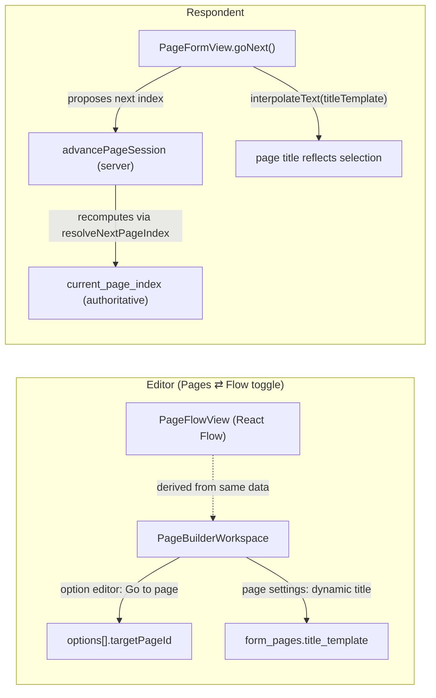

# FT-025: Story Mode — Per-Option Branching, Dynamic Page Titles & Flow View

> **Feature Plan** — Choice-driven routing for page forms. A creator puts a select/radio question on a page, and for each option decides "what happens next": jump the respondent to a specific page (including the final page), or keep the linear flow. The destination page's title can be influenced by the answer (`{{need}} Details` → "Plumbing Details"). A new **Flow view** in the editor renders the same page form as a branching story map so creators can see — at a glance — where every choice leads. This turns PonkoForm page forms from a linear questionnaire into a branching, story-like experience without a second data model.

**Status:** 🚧 **Planned** — not yet implemented

**Dependencies:**
- ✅ **FT-007 (Page Builder)** — pages (`form_pages`), fields (`form_page_fields`), and options (JSONB) are the substrate. Routing and dynamic titles extend this model only.
- ✅ **FT-013 (Invoicing Builder / Email Delivery)** — the `{{token}}` interpolation engine in `src/lib/invoicing/template.ts` (`interpolateText`, `extractTemplateTokens`) is reused verbatim for dynamic page titles.
- ✅ **Flow Builder (existing)** — `@xyflow/react` is already a dependency and already rendered by `FlowCanvasWorkspace`; the new Flow view reuses it client-side with zero new packages.
- ✅ **FT-014 (Satisfaction Field)** — satisfaction fields store numeric option values; score-based routing ("if rating ≤ 2 → go to follow-up page") is a natural v1.1 extension, not part of v1.
- 🚧 **FT-022 (Email Automation)** — complementary, not blocking: a "jump to final page" combined with a low-score follow-up email is a later enhancement.
- ⬜ **No new external dependencies.**

---

## 1. User Story & Problem

### 1.1 Current State

Page forms advance **linearly and only linearly**:

- `PageFormView.goNext()` in `src/components/page-form/PageFormView.tsx` computes `nextIndex = currentPageIndex + 1` unconditionally.
- `advancePageSession` in `src/lib/server-fns/page-forms.ts` trusts the client-sent `currentPageIndex` and persists it.
- `field_conditions` support only `show`/`hide` (per-field visibility, `ConditionAction = 'show' | 'hide'` in `src/lib/page-builder/types.ts`). There is no "go to page X" action.
- Page titles are static (`form_pages.title`), rendered at `PageFormView.tsx` L492-496.

**What creators can't do today:**

| Scenario | Can they do it? |
|---|---|
| "If they pick Plumbing, skip the Electrical questions" | ❌ |
| "If they pick Enterprise, go straight to the payment page" | ❌ |
| "Show me a map of where every choice leads" | ❌ |
| "Title the next page based on their choice ('Plumbing Details')" | ❌ |

### 1.2 What the User Wants

> "I have an options/choices input in a page. If the user picked this, what will happen — they will be redirected to here, or the name of the page will be influenced by the selection."

Concretely, three capabilities, all inside the **page-form** paradigm:

1. **Per-option routing**: each option of a choice field can point at a destination page ("go to"), including the final page or a payment page.
2. **Dynamic page titles**: a page's title can be a template that interpolates previously collected answers, so the same page reads differently depending on the route taken.
3. **Flow Mode toggle**: a visual, story-like map of the form's branching so the creator sees and trusts where every choice leads.

### 1.3 Solution

- Extend the option shape with `targetPageId` (**JSONB — no schema migration for routing**).
- Add one nullable column `form_pages.title_template` (single small migration).
- Add a pure routing helper `resolveNextPageIndex()` and make the server the authority on the next page index.
- Render a client-derived **Flow view** (React Flow) of the same page form, toggled in the unified editor.

This deliberately does **not** convert page forms into flow forms (`flows`/`flow_nodes`). The existing Flow Builder remains for graph-native journeys (calculators, mid-branch payment nodes, redirects). Story Mode is the page form's branching layer — one source of truth, no conversion, no drift.

---

## 2. System Design — Schema & Architecture

### 2.1 Why Routing Needs No Migration

`form_page_fields.options` is already a typed JSONB column (`src/db/schema.ts` L366-374). Adding an optional per-option page target is a **type-level change only**:

```ts
// src/db/schema.ts — options $type
options: jsonb('options').$type<{
  label: string
  value: string
  emoji?: string | null
  price?: number | null
  priceReference?: string | null
  additionalPrice?: number | null
  additionalPriceReference?: string | null
  /** Story Mode: jump to this page when the option is selected (same-form page id). */
  targetPageId?: number | null
}[]>()
```

```ts
// src/lib/page-builder/types.ts — PageFieldOption
export interface PageFieldOption {
  label: string
  value: string
  emoji?: string | null
  price?: number | null
  priceReference?: string | null
  additionalPrice?: number | null
  additionalPriceReference?: string | null
  targetPageId?: number | null
}
```

### 2.2 New Column: `form_pages.title_template`

```sql
-- drizzle/0038_story_mode.sql
ALTER TABLE "form_pages" ADD COLUMN IF NOT EXISTS "title_template" varchar(255);
```

- `null`/empty → render `title` exactly as today (backward compatible).
- Non-empty → the respondent-facing title is `interpolateText(titleTemplate, { values: collectedData })` (reuse from `src/lib/invoicing/template.ts`).
- Unknown/unfilled tokens render empty, matching existing invoicing behavior.

### 2.3 Routing Semantics (v1 scope)

| Rule | Decision |
|---|---|
| Eligible fields | `select` and `radio` only (single-choice). `checkbox`, `satisfaction`, `payment` are v1.1+ |
| Precedence | Scan the current page's eligible fields in `position` order; **first field with a selected option that has a `targetPageId` wins** |
| No match | Default behavior: `currentPageIndex + 1` (unchanged) |
| `targetPageId` validity | Must reference a `form_pages.id` in the same form; invalid/unknown ids are ignored at runtime and flagged at publish time |
| Target = final page | Allowed; the final page still runs its existing completion logic (template, redirect, payment gating) |
| Target = payment page | Allowed; existing payment gating in `completePageSubmissionRecord` still applies |
| Backward jumps | Allowed (common pattern); publish-time warning when a 2-node loop is detected |
| Multiple targets on same page | Only one wins per the precedence rule above; the UI disables routing on multi-select fields |

### 2.4 Pure Routing Helper

New file `src/lib/page-builder/routing.ts` — pure, unit-testable, no DB/UI deps:

```ts
export function resolveNextPageIndex(
  pages: Pick<FormPage, 'id' | 'position'>[],
  fields: { position: number; fieldType: string; bindVariable: string; options: PageFieldOption[] | null }[],
  data: Record<string, unknown>,
  currentPageIndex: number,
): number
```

Algorithm:
1. `orderedFields = fields.sortBy(position)` filtered to `select`/`radio`.
2. For each field, read `data[field.bindVariable]` (string or array of strings); find the option whose `value` matches.
3. First option with a truthy `targetPageId` → return the **index** of the page with that id (via `pages` lookup by `id`; ignore if absent).
4. Otherwise → `currentPageIndex + 1`.

### 2.5 Server-Authoritative Routing

`advancePageSession` already loads the form's pages via `hydratePages(existing.formId)` (L924-925) — so the server can compute the next index itself instead of trusting the client:

```ts
// src/lib/server-fns/page-forms.ts — advancePageSession handler (change)
const pages = await hydratePages(existing.formId)
const merged = mergeSubmissionSessionData(existing, data.collectedData)   // existing logic
const nextIndex = resolveNextPageIndex(pages, pages.flatMap(p => p.fields), merged, data.currentPageIndex)
// persist currentPageIndex: nextIndex  (server value wins)
```

- The client still proposes an index for optimistic UX, but the **server-returned `currentPageIndex` is authoritative** and `PageFormView` adopts it from the mutation result.
- This keeps resume (`getPageSessionData`) and the email-survey path working unchanged, since they only read `current_page_index`.

### 2.6 Dynamic Title Rendering

`PageFormView.tsx` L492-496 becomes:

```tsx
const title = currentPage.titleTemplate
  ? interpolateText(currentPage.titleTemplate, { values: data, formTitle: currentPage.title, submissionId: 0, submittedAt: new Date() } as InvoiceTemplateContext)
  : currentPage.title
```

`FormPage` (in `src/lib/page-builder/types.ts`) gains `titleTemplate: string | null`.

### 2.7 Flow View — Client-Derived Story Map

The editor already loads the full page form (`pageForm.pages` incl. fields). The Flow view is derived with `useMemo` — **no new server function, no second persistence layer**:

```ts
// src/components/page-builder/page-flow.ts (pure derivation)
export interface PageFlowEdge {
  id: string
  source: string      // page node id
  target: string
  label?: string      // option label for branch edges
}
export function derivePageFlow(pages: FormPage[]): { nodes: PageFlowNode[]; edges: PageFlowEdge[] }
```

- One node per page (label = `titleTemplate`-preview or title; final pages styled as terminals).
- Default edge `page[i] → page[i+1]` for every consecutive pair.
- Branch edge `page → targetPage` per option with a `targetPageId`, labeled with the option label; default edges to a page that is also a target are suppressed.
- Rendered with `@xyflow/react` (`ReactFlow` + `Background` + custom node component) in a read-only canvas (v1). Clicking a node switches the editor to Pages view and opens that page.

### 2.8 Architecture Diagram



---

## 3. UI Design

### 3.1 Option Editor — "Go to page" per option

Extend `src/components/page-builder/OptionsEditor.tsx` (used by `OptionsDialog` from `FieldSettings.tsx`):

- `OptionsEditor` gains a `pages` prop (`{ id, title }[]`) and a `showRouting` flag (`fieldType === 'select' | 'radio'`).
- Each option row gains a **"Go to"** select: `Next page (default)` | each other page by title | `Final page`.
- Selecting a destination writes `option.targetPageId`; selecting "Next page" clears it (`null`).
- The routing column is hidden entirely for non-choice fields and multi-select (`checkbox`) fields.

### 3.2 Page Settings — Dynamic title + token picker

In the page settings panel of `PageBuilderWorkspace`:

- A **"Dynamic title"** toggle. When on, the title input is replaced by a template input with a **token picker** listing all bind variables of earlier pages + form references (the same variable list the invoicing builder and `LogicDialog` already use).
- Live preview: the panel shows `interpolateText(template, sampleContext(...))` with sample values, so the creator sees "Plumbing Details" style output before publishing.
- The `title` field remains required (fallback when `titleTemplate` is empty).

### 3.3 Editor Mode Toggle — Pages ⇄ Flow

In `src/routes/forms/$formId/edit.tsx`:

- A segmented control **Pages | Flow** in the editor toolbar, shown only when the form is page-form backed (no flow).
- `view` state (reuse the existing `View = 'list' | 'canvas'` pattern, or add `'pages' | 'flow'` for the page-form branch).
- `Pages` → current `PageBuilderWorkspace`; `Flow` → new `PageFlowView`.

### 3.4 Flow View graph

New `src/components/page-builder/PageFlowView.tsx`:

- `ReactFlow` with `nodesDraggable={false}`, `elementsSelectable` on for click-to-navigate, `fitView`.
- Node body: page title (or template preview), a subtle `final` badge for `isFinal` pages, and a small "payment" badge for payment pages.
- Edge styling: default next-edges are neutral; branch edges carry the option label and use the accent color (`#cc785c`) so branch decisions pop.
- A legend footer ("Choices with a destination are shown as labeled branches. Everything else flows top to bottom.").

---

## 4. Server Functions

| Function | Change |
|---|---|
| `advancePageSession` (`src/lib/server-fns/page-forms.ts`) | Recompute `nextIndex` with `resolveNextPageIndex` from server-loaded pages + merged data; persist server value; return it (already returns `currentPageIndex`) |
| `getPageSessionData`, `startPageSession` | No change (they read `current_page_index`) |
| `completePageSubmissionRecord` | No change (final-page logic, payment gating, reCAPTCHA, email dispatch untouched) |
| New: `validatePageRouting(pages)` (in `src/lib/page-builder/routing.ts`) | Returns warnings: `targetPageId` referencing a missing page; self-loop; 2-page loop; multiple routable fields on one page (informational). Called at publish time and surfaced in the Flow view |
| Publish flow (`publishMutation` in `edit.tsx`) | Surface `validatePageRouting` warnings as non-blocking confirmations (mirrors the flow validator badge behavior) |

No new endpoint is required for the Flow view — it is derived client-side from data the editor already fetches.

---

## 5. File Change Summary

| # | Action | File | Reason |
|---|---|---|---|
| 1 | **Modify** | `src/db/schema.ts` | Add `targetPageId?` to the `options` `$type`; add `titleTemplate` to `formPages` |
| 2 | **Create** | `drizzle/0038_story_mode.sql` | `ALTER TABLE form_pages ADD COLUMN title_template varchar(255)` |
| 3 | **Modify** | `src/lib/page-builder/types.ts` | `PageFieldOption.targetPageId`, `FormPage.titleTemplate`, `PageForm` passthrough |
| 4 | **Create** | `src/lib/page-builder/routing.ts` | `resolveNextPageIndex` + `validatePageRouting` (pure) |
| 5 | **Create** | `src/lib/page-builder/routing.test.ts` | Unit tests for routing precedence, defaults, invalid targets, loops |
| 6 | **Modify** | `src/lib/server-fns/page-forms.ts` | `advancePageSession` computes and persists server-authoritative next index |
| 7 | **Modify** | `src/components/page-form/PageFormView.tsx` | `goNext()` uses `resolveNextPageIndex` for local/preview UX; adopts server-returned index; renders interpolated `titleTemplate` |
| 8 | **Modify** | `src/components/page-builder/OptionsEditor.tsx` + `OptionsDialog.tsx` | Per-option "Go to" select for choice fields |
| 9 | **Modify** | `src/components/page-builder/FieldSettings.tsx` | Pass `pages` + `showRouting` into the options dialog |
| 10 | **Modify** | `src/components/page-builder/PageBuilderWorkspace.tsx` | Page settings: dynamic title toggle + token picker + preview |
| 11 | **Create** | `src/components/page-builder/page-flow.ts` | Pure `derivePageFlow` (nodes/edges) |
| 12 | **Create** | `src/components/page-builder/PageFlowView.tsx` | React Flow story map (read-only v1, click-to-navigate) |
| 13 | **Modify** | `src/routes/forms/$formId/edit.tsx` | Pages ⇄ Flow toggle; wire `PageFlowView`; publish-time routing warnings |
| 14 | **Modify** | `src/components/page-form/PageFormView.test.tsx` | Jump routing + dynamic title tests |
| 15 | **Modify** | `docs/current-system.md`, `memory-ponko/DATABASE.md`, `memory-ponko/ARCHITECTURE.md` | Document Story Mode, `title_template`, routing rules |

---

## 6. Step-by-Step Tasks

### Task 1: Types + migration
- [ ] Add `targetPageId?` to `options` `$type` in `src/db/schema.ts`
- [ ] Add `titleTemplate` column to `formPages` in `src/db/schema.ts`
- [ ] Create `drizzle/0038_story_mode.sql` (`ADD COLUMN IF NOT EXISTS`)
- [ ] Update `PageFieldOption`, `FormPage` in `src/lib/page-builder/types.ts`
- [ ] Run `pnpm db:check` (schema drift guard)

### Task 2: Routing helper + tests
- [ ] Implement `resolveNextPageIndex` (precedence rule, default `+1`, invalid target ignored)
- [ ] Implement `validatePageRouting` (missing page, self-loop, 2-page loop, informational notes)
- [ ] Write `routing.test.ts`: no targets; single target; first-match precedence; jump to final; target to missing page ignored; backward jump; 2-page loop detection

### Task 3: Server-authoritative advance
- [ ] In `advancePageSession`, compute `nextIndex` from server pages + merged data; persist it; ensure the response returns it
- [ ] Verify resume, email-survey sessions, and preview path still pass existing tests

### Task 4: Respondent runtime
- [ ] `PageFormView.goNext()` uses `resolveNextPageIndex` (preview mode included)
- [ ] Adopt the server-returned index from `advanceMut` result instead of the local proposal
- [ ] Render `titleTemplate` via `interpolateText` with collected data; fallback to `title`
- [ ] Tests: jump navigation, dynamic title rendering, back behavior stays `index - 1` (documented v1 limit)

### Task 5: Option editor UI
- [ ] `OptionsEditor`/`OptionsDialog`: per-option "Go to" select for `select`/`radio`; hidden for `checkbox` and non-choice fields; default = Next page
- [ ] `FieldSettings` passes `pages` + `showRouting`

### Task 6: Page settings — dynamic title
- [ ] Toggle + template input + token picker in `PageBuilderWorkspace`
- [ ] Live sample preview via `sampleContext`/`interpolateText`

### Task 7: Flow view
- [ ] `derivePageFlow` (nodes, default edges, labeled branch edges, terminal styling)
- [ ] `PageFlowView` with `@xyflow/react`; click node → open that page in Pages view
- [ ] Pages ⇄ Flow toggle in `edit.tsx`; publish-time `validatePageRouting` warnings

### Task 8: Docs + verification
- [ ] Update `docs/current-system.md`, `memory-ponko/DATABASE.md`, `memory-ponko/ARCHITECTURE.md`
- [ ] `pnpm test` (full suite), `pnpm build`, manual smoke of a branching form end-to-end

---

## 7. Risks & Open Questions

| Risk / question | Mitigation / decision |
|---|---|
| **Client/server index disagreement** (tampering or race) | Server recomputes and returns the authoritative index; client adopts it |
| **Back button after a jump** skips intermediate pages (`index - 1`) | Accepted for v1; v1.1 adds `page_history` JSONB on `form_submission_sessions` and pops history in `goBack()` |
| **Loop risk** (A → B → A) | Allowed but warned at publish time (`validatePageRouting`); runtime has no hard cap in v1 |
| **Multi-select routing ambiguity** | Excluded in v1 (`checkbox` has no "Go to"); revisit with "first selected" semantics later |
| **Satisfaction-score routing** ("rating ≤ 2 → follow-up") | Natural v1.1 addition: same `targetPageId` mechanism keyed by numeric option values |
| **Flow view vs existing Flow Builder naming** | Story Mode is a *view of the page form*, not `flows` data; docs call it "Flow view" and clarify the distinction |
| **`interpolateText` lives in `invoicing/`** | v1 imports it directly (small, stable API); a shared `src/lib/template-text.ts` extraction is a cleanup follow-up, not required |
| **Existing data** | `title_template` nullable → old rows render identically; options without `targetPageId` behave exactly as today |
| **Preview parity** | Draft preview uses the same `resolveNextPageIndex`, so creators validate routing before publish |

---

## 8. Validation / Testing

| Check | How |
|---|---|
| Routing unit tests pass | `pnpm vitest run src/lib/page-builder/routing.test.ts` |
| Full suite green | `pnpm test` |
| No schema drift | `pnpm db:check` |
| Branch jump works end-to-end | Publish a 3-page form with select routing: pick option A → page 3; option B → page 2; default → next page |
| Server authority | Manually POST a forged `currentPageIndex` to `advancePageSession` → server returns the routed index |
| Dynamic title | Page with `{{need}} Details` renders "Plumbing Details" / "Electrical Details" per selection; empty when unfilled |
| Final-page jump | Option targeting the final page completes the submission and runs its template/redirect |
| Flow view | Toggle Pages ⇄ Flow; graph shows labeled branches; clicking a node opens that page |
| Back behavior | After a jump, Back returns to the previous *sequence* page (documented v1 limit) |
| Regression | Email survey sessions, payment pages, reCAPTCHA, resume-all still pass existing tests |
