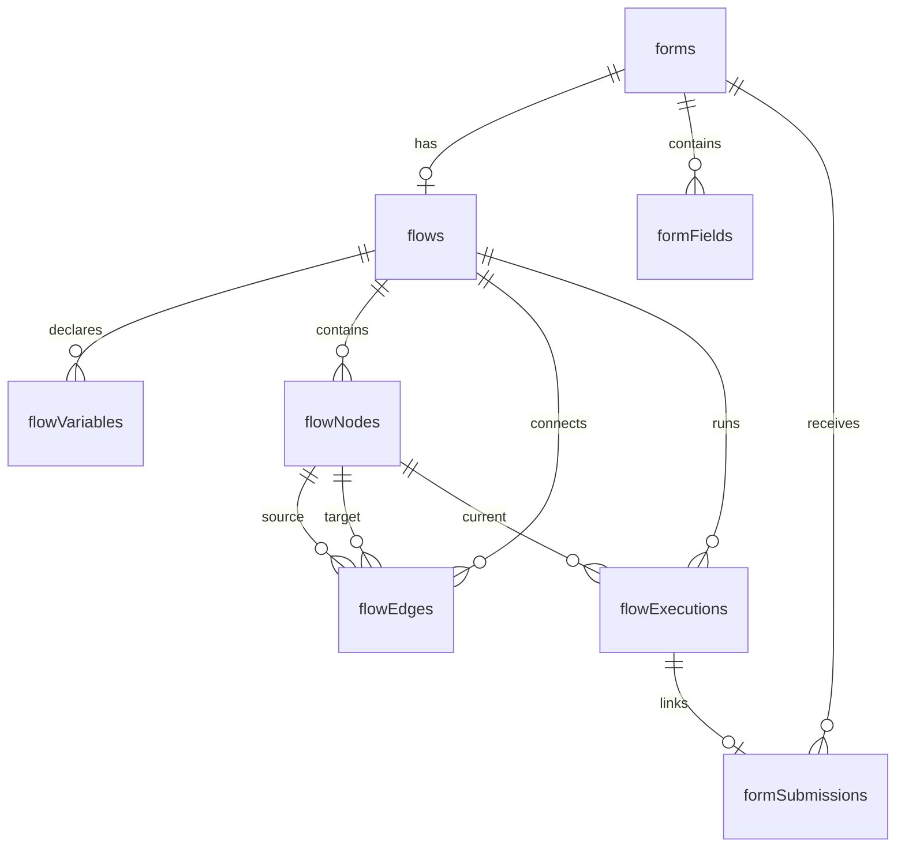

# Flow Builder — Technical Specification

> **Version:** 1.0
> **Depends on:** Existing PonkoForm schema (profiles, forms, form_fields, form_submissions, payment_gateways, form_payment_configs, payments)
> **Cross-references:** vision.md, requirements.md

---

## 1. Architecture Overview

### 1.1 High-Level Layered Architecture

```
┌─────────────────────────────────────────────────┐
│                 Flow Builder UI                   │
│  ┌──────────┐  ┌────────────────┐  ┌──────────┐  │
│  │  Node     │  │  Flow Canvas   │  │  Config   │  │
│  │  Palette  │  │  (React Flow)  │  │  Panel    │  │
│  └──────────┘  └────────────────┘  └──────────┘  │
│  ┌──────────────────────────────────────────────┐ │
│  │         Variables Manager Sidebar             │ │
│  └──────────────────────────────────────────────┘ │
└──────────────────────┬──────────────────────────┘
                       │
┌──────────────────────▼──────────────────────────┐
│            Flow Execution UI (End User)          │
│  ┌──────────────────┐  ┌─────────────────────┐   │
│  │  Step Renderer    │  │  Flow Progress Bar  │   │
│  └──────────────────┘  └─────────────────────┘   │
└──────────────────────┬──────────────────────────┘
                       │
┌──────────────────────▼──────────────────────────┐
│              Flow Runtime Engine                  │
│  ┌──────────┐  ┌──────────┐  ┌────────────────┐  │
│  │  Node     │  │  Context │  │  Expression    │  │
│  │  Router   │  │  Manager │  │  Evaluator     │  │
│  └──────────┘  └──────────┘  └────────────────┘  │
└──────────────────────┬──────────────────────────┘
                       │
┌──────────────────────▼──────────────────────────┐
│            Server Functions / API Layer           │
│  ┌──────────┐  ┌──────────┐  ┌────────────────┐  │
│  │  Flow     │  │  Node     │  │  Execution     │  │
│  │  CRUD     │  │  CRUD     │  │  Management    │  │
│  └──────────┘  └──────────┘  └────────────────┘  │
└──────────────────────┬──────────────────────────┘
                       │
┌──────────────────────▼──────────────────────────┐
│              Database (Neon / Drizzle)            │
│  ┌──────────┐  ┌──────────┐  ┌────────────────┐  │
│  │  flows    │  │  flow_   │  │  flow_         │  │
│  │           │  │  nodes   │  │  executions    │  │
│  └──────────┘  └──────────┘  └────────────────┘  │
└─────────────────────────────────────────────────┘
```

### 1.2 Key Technology Decisions

| Decision | Choice | Rationale |
|---|---|---|
| Flow canvas library | **React Flow** (xyflow/react) | Mature, well-documented node-based canvas with built-in edge drawing, zoom, pan, and custom node support |
| Expression evaluator | **math.js** with sandboxing | Safe evaluation, built-in math functions, variable substitution, no eval() |
| State management | **TanStack Store** (existing) | Already in project; runtime flow state fits store pattern well |
| Flow builder route | `/forms/$formId/flow` | New tab alongside existing Edit tab |
| Flow execution route | `/forms/submit/$formId` | Extended existing submission route to support flow mode |

---

## 2. Database Schema

### 2.1 New Tables

All tables use the existing project conventions (serial PKs, timestamps, indexes).

```typescript
// ── src/db/schema.ts additions ──

/**
 * FLOWS
 * Links a flow definition to a form.
 * A form can have one flow. If no flow exists, the form behaves as a
 * traditional linear form (backward compatibility per REQ-4.1).
 */
export const flows = pgTable(
  'flows',
  {
    id: serial().primaryKey(),
    formId: integer('form_id')
      .notNull()
      .unique()                     // One flow per form
      .references(() => forms.id, { onDelete: 'cascade' }),
    startNodeId: integer('start_node_id'),  // FK to flow_nodes, set after node creation
    createdAt: timestamp('created_at').defaultNow().notNull(),
    updatedAt: timestamp('updated_at').defaultNow().notNull(),
  },
  (table) => [index('flows_form_id_idx').on(table.formId)],
)

/**
 * FLOW VARIABLES
 * Typed variable declarations scoped to a flow.
 * Variables are accessible to any node in the flow at runtime.
 */
export const flowVariables = pgTable(
  'flow_variables',
  {
    id: serial().primaryKey(),
    flowId: integer('flow_id')
      .notNull()
      .references(() => flows.id, { onDelete: 'cascade' }),
    name: varchar('name', { length: 100 }).notNull(),    // snake_case identifier
    type: varchar('type', { length: 20 }).notNull()       // 'string' | 'number' | 'boolean' | 'money'
      .$type<'string' | 'number' | 'boolean' | 'money'>(),
    defaultValue: text('default_value'),                   // Stored as string, parsed by type
    description: text('description'),
    createdAt: timestamp('created_at').defaultNow().notNull(),
  },
  (table) => [
    uniqueIndex('flow_variables_flow_id_name_idx').on(table.flowId, table.name),
  ],
)

/**
 * FLOW NODES
 * Each node in the flow graph. The `config` JSONB holds type-specific configuration.
 * 
 * Config shape per node type:
 * 
 * FormField:
 *   { fieldType: string, label: string, placeholder?: string, required: boolean,
 *     options?: {label:string,value:string}[], bindToVariable?: string }
 * 
 * Decision:
 *   { sourceVariable: string, branches: { value: string, label: string }[] }
 *   // Edges from this node determine which branch leads where.
 *   // Each edge carries metadata: { matchValue: string }.
 * 
 * Calculator:
 *   { targetVariable: string, expression: string, label?: string }
 *   // expression example: "{{subtotal}} * 0.12"
 * 
 * Payment:
 *   { amountVariable: string, currency: string, gatewayId: number,
 *     label?: string }
 *   // Edges: first = success path, second (optional) = failure path
 * 
 * Summary:
 *   { title: string, template: string }
 *   // template example: "Thank you {{customer_name}}! Total: {{total_cost}}"
 * 
 * Redirect:
 *   { urlTemplate: string }
 *   // urlTemplate example: "https://example.com/course-access?ref={{payment_ref}}"
 */
export const flowNodes = pgTable(
  'flow_nodes',
  {
    id: serial().primaryKey(),
    flowId: integer('flow_id')
      .notNull()
      .references(() => flows.id, { onDelete: 'cascade' }),
    type: varchar('type', { length: 30 }).notNull()
      .$type<'start' | 'form_field' | 'decision' | 'calculator' | 'payment' | 'summary' | 'redirect'>(),
    label: varchar('label', { length: 255 }),
    config: jsonb('config').$type<Record<string, unknown>>().notNull().default({}),
    positionX: integer('position_x').notNull().default(0),   // Canvas X position
    positionY: integer('position_y').notNull().default(0),   // Canvas Y position
    createdAt: timestamp('created_at').defaultNow().notNull(),
  },
  (table) => [index('flow_nodes_flow_id_idx').on(table.flowId)],
)

/**
 * FLOW EDGES
 * Directed connections between nodes. Each edge belongs to a flow.
 * For Decision nodes, edges carry a `matchValue` in their metadata to
 * indicate which branch they represent.
 */
export const flowEdges = pgTable(
  'flow_edges',
  {
    id: serial().primaryKey(),
    flowId: integer('flow_id')
      .notNull()
      .references(() => flows.id, { onDelete: 'cascade' }),
    sourceNodeId: integer('source_node_id')
      .notNull()
      .references(() => flowNodes.id, { onDelete: 'cascade' }),
    targetNodeId: integer('target_node_id')
      .notNull()
      .references(() => flowNodes.id, { onDelete: 'cascade' }),
    metadata: jsonb('metadata').$type<{
      matchValue?: string    // For Decision node edges — which option triggers this path
      label?: string         // Optional display label on the edge
    }>().default({}),
    createdAt: timestamp('created_at').defaultNow().notNull(),
  },
  (table) => [index('flow_edges_flow_id_idx').on(table.flowId)],
)

/**
 * FLOW EXECUTIONS
 * Records a single run of a flow by an end user.
 * Stores the entire execution context at completion.
 */
export const flowExecutions = pgTable(
  'flow_executions',
  {
    id: serial().primaryKey(),
    flowId: integer('flow_id')
      .notNull()
      .references(() => flows.id, { onDelete: 'cascade' }),
    formSubmissionId: integer('form_submission_id')
      .references(() => formSubmissions.id, { onDelete: 'set null' }),
    status: varchar('status', { length: 20 }).notNull().default('in_progress')
      .$type<'in_progress' | 'completed' | 'payment_pending' | 'payment_failed' | 'cancelled'>(),
    currentNodeId: integer('current_node_id')
      .references(() => flowNodes.id),
    variables: jsonb('variables').$type<Record<string, unknown>>().default({}),
    history: jsonb('history').$type<{
      nodeId: number
      nodeType: string
      enteredAt: string   // ISO timestamp
      data?: unknown      // Snapshot of data at this step
    }[]>().default([]),
    completedAt: timestamp('completed_at'),
    createdAt: timestamp('created_at').defaultNow().notNull(),
  },
  (table) => [index('flow_executions_flow_id_idx').on(table.flowId)],
)
```

### 2.2 Migration

- Generate via `drizzle-kit generate`
- Apply via `drizzle-kit migrate`
- Seed: No seed data needed (tables are populated by creator actions)

### 2.3 ERD



---

## 3. File Structure

New files to create, following existing project patterns:

```
src/
├── components/
│   ├── flow-builder/                  # NEW: Flow builder UI components
│   │   ├── FlowCanvas.tsx             # React Flow canvas wrapper
│   │   ├── FlowPalette.tsx            # Draggable node type palette
│   │   ├── nodes/                     # Custom React Flow node components
│   │   │   ├── StartNode.tsx
│   │   │   ├── FormFieldNode.tsx
│   │   │   ├── DecisionNode.tsx
│   │   │   ├── CalculatorNode.tsx
│   │   │   ├── PaymentNode.tsx
│   │   │   ├── SummaryNode.tsx
│   │   │   └── RedirectNode.tsx
│   │   ├── NodeConfigPanel.tsx        # Right-side properties panel
│   │   ├── config-forms/              # Config forms per node type
│   │   │   ├── FormFieldConfig.tsx
│   │   │   ├── DecisionConfig.tsx
│   │   │   ├── CalculatorConfig.tsx
│   │   │   ├── PaymentConfig.tsx
│   │   │   ├── SummaryConfig.tsx
│   │   │   └── RedirectConfig.tsx
│   │   ├── VariablesManager.tsx       # Sidebar/modal for variable CRUD
│   │   ├── FlowToolbar.tsx            # Save, Validate, Preview buttons
│   │   ├── FlowValidationBadge.tsx    # Error indicator badge
│   │   └── FlowPreviewPanel.tsx       # Test-run panel
│   │
│   └── flow-execution/                # NEW: End-user flow execution components
│       ├── FlowStepRenderer.tsx        # Renders current node step
│       ├── FlowProgressBar.tsx         # Step progress indicator
│       ├── CalculatorDisplay.tsx       # Shows calculator result inline
│       └── PaymentStep.tsx            # Payment integration in flow
│
├── lib/
│   ├── flow-engine/                    # NEW: Flow runtime engine
│   │   ├── FlowEngine.ts              # Core execution loop
│   │   ├── ExpressionEvaluator.ts     # Safe math expression evaluation
│   │   ├── TemplateInterpolator.ts    # {{variable}} replacement in strings
│   │   ├── FlowValidator.ts           # Build-time validation logic
│   │   └── types.ts                   # Flow-related TypeScript types
│   │
│   └── server-fns/
│       ├── flows.ts                   # NEW: Server functions for flow CRUD
│       ├── flow-nodes.ts              # NEW: Server functions for node CRUD
│       └── flow-executions.ts          # NEW: Server functions for execution management
│
└── routes/
    ├── forms/
    │   └── $formId/
    │       └── flow.tsx                # NEW: Flow builder page route
    ├── forms/submit/
    │   └── $formId.tsx                 # MODIFIED: Support flow mode + linear mode
    └── flow/
        └── $executionId/
            └── complete.tsx            # NEW: Post-execution summary page
```

---

## 4. Core Type Definitions

Located in `src/lib/flow-engine/types.ts`:

```typescript
// ── Node Types ──

export type FlowNodeType =
  | 'start'
  | 'form_field'
  | 'decision'
  | 'calculator'
  | 'payment'
  | 'summary'
  | 'redirect'

export interface FlowNodeConfig {
  // Common
  label?: string

  // FormField
  fieldType?: string
  placeholder?: string
  required?: boolean
  options?: { label: string; value: string }[]
  bindToVariable?: string

  // Decision
  sourceVariable?: string
  branches?: { value: string; label: string }[]

  // Calculator
  targetVariable?: string
  expression?: string

  // Payment
  amountVariable?: string
  currency?: string
  gatewayId?: number

  // Summary
  title?: string
  template?: string

  // Redirect
  urlTemplate?: string
}

// ── Flow Graph Types ──

export interface FlowNode {
  id: number
  flowId: number
  type: FlowNodeType
  label: string | null
  config: FlowNodeConfig
  positionX: number
  positionY: number
}

export interface FlowEdge {
  id: number
  flowId: number
  sourceNodeId: number
  targetNodeId: number
  metadata: {
    matchValue?: string
    label?: string
  }
}

export interface FlowVariable {
  id: number
  flowId: number
  name: string
  type: 'string' | 'number' | 'boolean' | 'money'
  defaultValue: string | null
  description: string | null
}

// ── Runtime Types ──

export type ExecutionStatus =
  | 'in_progress'
  | 'completed'
  | 'payment_pending'
  | 'payment_failed'
  | 'cancelled'

export interface ExecutionHistoryEntry {
  nodeId: number
  nodeType: string
  enteredAt: string
  data?: unknown
}

export interface FlowExecutionContext {
  executionId: number
  flowId: number
  status: ExecutionStatus
  currentNodeId: number | null
  variables: Record<string, unknown>
  history: ExecutionHistoryEntry[]
  formSubmissionId?: number
}

// ── Expression Types ──

export interface ExpressionScope {
  variables: Record<string, unknown>
  functions: Record<string, (...args: unknown[]) => unknown>
}

// ── Flow Validation Types ──

export interface FlowValidationError {
  nodeId?: number
  edgeId?: number
  type: 'missing_config' | 'disconnected' | 'type_mismatch' | 'cycle_detected' | 'missing_start'
  message: string
}
```

---

## 5. Flow Runtime Engine Design

### 5.1 Execution Loop

The `FlowEngine` class drives the runtime execution on the client side. It:

1. Takes a `Flow` (nodes + edges) and creates an execution context
2. Starts from the `start` node and follows edges
3. At each node, determines the next action based on node type
4. Maintains a shared variable scope
5. Records execution history

```typescript
// ── src/lib/flow-engine/FlowEngine.ts (conceptual) ──

/**
 * FlowEngine
 * 
 * Drives step-by-step execution of a flow definition.
 * 
 * Usage:
 *   const engine = new FlowEngine(flowNodes, flowEdges, initialVariables)
 *   const step = engine.getCurrentStep()
 *   // Render step, get user input
 *   engine.advance({ userInput: value })  // or evaluate calculation
 *   const nextStep = engine.getCurrentStep()
 *   // ... continue until complete
 */
class FlowEngine {
  // Core methods:
  
  /** Returns the current node to render */
  getCurrentStep(): FlowStep
  
  /** 
   * Advance to the next node.
   * For FormField: stores user input to variable, follows default edge
   * For Decision: evaluates sourceVariable, follows matching edge
   * For Calculator: evaluates expression, stores result, follows default edge
   * For Payment: initiates payment, follows success/failure edge
   * For Summary: returns the rendered template
   * For Redirect: returns the constructed URL
   */
  advance(input?: StepInput): void
  
  /** Go back to the previous step (if history allows) */
  goBack(): void
  
  /** Returns true if the flow has reached a terminal node (Summary or Redirect) */
  isComplete(): boolean
  
  /** Returns the serializable execution context for persistence */
  getSnapshot(): FlowExecutionContext
}
```

### 5.2 Expression Evaluator

Located in `src/lib/flow-engine/ExpressionEvaluator.ts`:

```typescript
/**
 * ExpressionEvaluator
 * 
 * Safely evaluates mathematical expressions with variable substitution.
 * Uses math.js with restricted scope — no access to global objects.
 * 
 * Supported syntax:
 *   - Arithmetic: +, -, *, /, %, parentheses
 *   - Variable references: {{subtotal}}, {{vat_rate}}
 *   - Functions: round(), sum(), min(), max(), abs()
 *   - Constants: numeric literals, string literals in quotes
 * 
 * Usage:
 *   const evaluator = new ExpressionEvaluator()
 *   const result = evaluator.evaluate('{{subtotal}} * (1 + {{vat_rate}})', {
 *     subtotal: 1000,
 *     vat_rate: 0.12
 *   })
 *   // result = 1120
 * 
 * Safety guarantees:
 *   - No access to eval(), Function(), or dynamic code execution
 *   - No access to window, document, or global scope
 *   - Only pure math operations and allowed functions
 *   - Input variables are explicitly scoped
 */
```

### 5.3 Template Interpolator

Located in `src/lib/flow-engine/TemplateInterpolator.ts`:

```typescript
/**
 * TemplateInterpolator
 * 
 * Replaces {{variable_name}} placeholders in strings with runtime values.
 * Supports formatting for money types (e.g., "$1,200.00").
 * 
 * Usage:
 *   const interpolator = new TemplateInterpolator()
 *   const result = interpolator.interpolate(
 *     'Thank you {{name}}! Total: {{total_cost}}',
 *     { name: 'Alice', total_cost: 1200 }
 *   )
 *   // result = 'Thank you Alice! Total: 1200'
 */
```

---

## 6. Flow Validation Rules

The `FlowValidator` must check:

| Rule | Check | Error Type |
|---|---|---|
| **Start node exists** | Exactly one `start` node in the flow | `missing_start` |
| **All nodes reachable** | BFS/DFS from start reaches every node | `disconnected` |
| **No cycles** | Graph is a DAG (no cycles except decision → merge patterns) | `cycle_detected` |
| **Config completeness** | All required config fields are set per node type | `missing_config` |
| **Variable references exist** | `sourceVariable`, `bindToVariable`, `targetVariable`, `amountVariable` reference declared variables | `missing_config` |
| **Decision branches match options** | If Decision's sourceVariable is bound to a FormField with options, branch values must be a subset of option values | `type_mismatch` |
| **Payment gateway exists** | `gatewayId` references an active gateway | `missing_config` |
| **Expression is valid** | Calculator expression can be parsed without errors | `missing_config` |
| **Edges per node type** | FormField/Calculator/Summary/Redirect: exactly one outgoing edge. Decision: one edge per branch + optional default. Payment: one or two edges (success + optional failure) | `missing_config` |

---

## 7. React Flow Integration

### 7.1 Custom Node Components

Each node type gets a custom React Flow node component in `src/components/flow-builder/nodes/`. The pattern:

```tsx
/**
 * Each custom node:
 * 1. Extends from React Flow's BaseNode or uses the NodeProps type
 * 2. Renders the node shape with type-specific icon and label
 * 3. Shows a validation badge if errors exist
 * 4. Has handle ports for edges (source on bottom, target on top)
 * 5. Is clickable to open the config panel
 * 
 * React Flow provides:
 *   - Node dragging on canvas
 *   - Edge drawing (connecting handles)
 *   - Pan and zoom
 *   - Selection
 *   - Minimap (optional)
 */
```

### 7.2 Canvas Configuration

```typescript
/**
 * FlowCanvas wraps React Flow with:
 *   - snap-to-grid (20px)
 *   - delete key to remove selected nodes/edges
 *   - custom node types registered via nodeTypes prop
 *   - edge type: smoothstep (for nice right-angle paths)
 *   - minimap in bottom-right corner
 *   - controls (zoom +/-) in bottom-left
 * 
 * The component manages:
 *   - nodes state (React Flow Node[])
 *   - edges state (React Flow Edge[])
 *   - onNodesChange / onEdgesChange handlers
 *   - onConnect for creating new edges
 *   - onNodeClick for opening config panel
 */
```

---

## 8. Server Functions

### 8.1 Flow CRUD (`flow.ts`)

| Function | Method | Purpose |
|---|---|---|
| `getFlow(formId)` | GET | Fetch flow, nodes, edges, variables for a form |
| `createFlow(formId)` | POST | Create a new flow with a single Start node |
| `updateFlowNode(nodeId, config)` | POST | Update a node's config/position |
| `addFlowNode(flowId, type, position)` | POST | Add a new node to the flow |
| `deleteFlowNode(nodeId)` | DELETE | Remove a node and its edges |
| `addFlowEdge(flowId, source, target, metadata)` | POST | Connect two nodes |
| `deleteFlowEdge(edgeId)` | DELETE | Remove an edge |
| `updateFlowEdge(edgeId, metadata)` | POST | Update edge metadata (e.g., matchValue) |
| `saveFlowLayout(flowId, nodes)` | POST | Bulk save node positions after drag |

### 8.2 Flow Variables CRUD

| Function | Method | Purpose |
|---|---|---|
| `getFlowVariables(flowId)` | GET | List all variables |
| `createFlowVariable(flowId, name, type, default)` | POST | Declare a new variable |
| `updateFlowVariable(varId, changes)` | POST | Update variable metadata |
| `deleteFlowVariable(varId)` | DELETE | Remove a variable (check no nodes reference it) |

### 8.3 Flow Execution

| Function | Method | Purpose |
|---|---|---|
| `startFlowExecution(flowId)` | POST | Create a new execution record, return first step |
| `advanceExecution(executionId, input)` | POST | Process current node, move to next, return updated step |
| `getExecutionState(executionId)` | GET | Get current execution context (for resume) |
| `completeExecution(executionId)` | POST | Mark execution as complete, store result |

---

## 9. Expression Syntax Specification

```
EXPRESSION = TERM (('+' | '-') TERM)*
TERM       = FACTOR (('*' | '/') FACTOR)*
FACTOR     = NUMBER
           | STRING
           | VARIABLE_REF
           | FUNCTION_CALL
           | '(' EXPRESSION ')'

VARIABLE_REF = '{{' IDENTIFIER '}}'
IDENTIFIER   = [a-zA-Z_][a-zA-Z0-9_]*

FUNCTION_CALL  = IDENTIFIER '(' ARG_LIST ')'
ARG_LIST       = (EXPRESSION (',' EXPRESSION)*)?

NUMBER     = [0-9]+('.'[0-9]+)?
STRING     = '"' [^"]* '"' | "'" [^']* "'"

Built-in functions:
  - round(x, decimals?)   — Round a number
  - sum(a, b, ...)        — Sum of values
  - min(a, b, ...)        — Minimum value
  - max(a, b, ...)        — Maximum value
  - abs(x)                — Absolute value
  - if(condition, then, else) — Conditional value (condition: value != null && value != '')
```

---

## 10. Backward Compatibility (REQ-4)

### 10.1 Detection Logic

```typescript
/**
 * When loading a form for submission:
 *   if (formHasFlow(formId)) {
 *     renderFlowSubmission()  // Flow-based multi-step
 *   } else {
 *     renderLegacyForm()      // Existing single-step form
 *   }
 */
```

### 10.2 Convert to Flow

When a creator clicks "Convert to Flow":
1. Create a new `flow` record for the form
2. Create a `start` node
3. For each `formField` in order, create a `form_field` node
4. Create edges: start → field1 → field2 → ... → last
5. Add a `summary` node at the end
6. Each FormField node creates a corresponding variable (bound via `bindToVariable`)
7. Existing `formFields` remain for backward rendering, but flow takes priority
