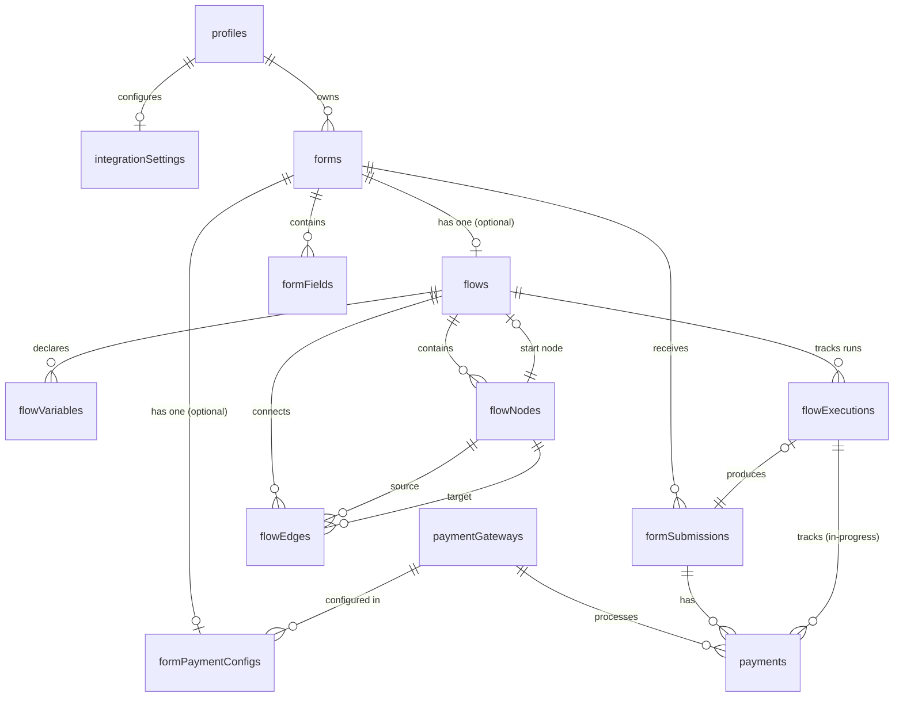

# PonkoForm Database Schema

> Part of [`memory-ponko/`](README.md) — System Memory

---

## 1. Overview

- **Database:** PostgreSQL (Neon serverless)
- **ORM:** Drizzle ORM v0.45
- **Schema location:** `src/db/schema.ts`
- **Migration tool:** Drizzle Kit (`drizzle-kit generate` / `drizzle-kit migrate`)
- **Seed scripts:** `scripts/seed-flow.ts`, `scripts/seed-service-flow.ts`

---

## 2. Entity Relationship Diagram



---

## 3. All Tables

### 3.1 `profiles`

The user profile. Maps one-to-one with Clerk accounts.

| Column | Type | Notes |
|---|---|---|
| `id` | `serial` PK | |
| `clerk_id` | `text` NOT NULL UNIQUE | Clerk user ID |
| `display_name` | `varchar(255)` | |
| `avatar_url` | `text` | |
| `created_at` | `timestamp` DEFAULT now | |

**Indexes:** `unique(profiles_clerk_id_idx)` on `clerk_id`

### 3.1a `integration_settings`

Per-user (per-profile) credentials for external services: payment gateways (Xendit, PayPal) and outbound email (SMTP). Each `*_config` column holds an **AES-256-GCM-encrypted JSON blob** (see `src/lib/crypto.ts`) — plaintext secrets are NEVER stored. A `null` column means that integration is not configured for the user.

| Column | Type | Notes |
|---|---|---|
| `id` | `serial` PK | |
| `profile_id` | `integer` NOT NULL UNIQUE → `profiles.id` (CASCADE) | One row per profile |
| `xendit_config` | `text` | Encrypted JSON; `null` = not configured |
| `paypal_config` | `text` | Encrypted JSON; `null` = not configured |
| `smtp_config` | `text` | Encrypted JSON; `null` = not configured |
| `created_at` | `timestamp` DEFAULT now | |
| `updated_at` | `timestamp` DEFAULT now | |

**Decrypted shapes:**
```
xenditConfig: { secretKey: string, webhookToken?: string }
paypalConfig: { clientId: string, clientSecret: string, mode: 'sandbox' | 'live' }
smtpConfig:   { host: string, port: number, secure: boolean, user: string,
                password: string, fromEmail: string, fromName?: string }
```

Server functions live in `src/lib/server-fns/integrations.ts`. The non-secret presence/metadata for the UI is derived server-side after decryption; raw secrets never reach the client.

### 3.2 `forms`

A form created by a user. Can be a linear form or have a flow attached.

| Column | Type | Notes |
|---|---|---|
| `id` | `serial` PK | |
| `profile_id` | `integer` NOT NULL → `profiles.id` (CASCADE) | Owner |
| `title` | `varchar(255)` NOT NULL | |
| `description` | `text` | |
| `status` | `form_status` enum | `'draft'` or `'published'` |
| `created_at` | `timestamp` DEFAULT now | |
| `updated_at` | `timestamp` DEFAULT now | |

**Indexes:** `index(forms_profile_id_idx)` on `profile_id`

### 3.3 `form_fields`

Fields in a linear (non-flow) form.

| Column | Type | Notes |
|---|---|---|
| `id` | `serial` PK | |
| `form_id` | `integer` NOT NULL → `forms.id` (CASCADE) | |
| `type` | `field_type` enum | `'text'`, `'email'`, `'number'`, `'textarea'`, `'select'`, `'checkbox'`, `'radio'`, `'payment'` |
| `label` | `varchar(255)` NOT NULL | |
| `placeholder` | `varchar(255)` | |
| `required` | `boolean` DEFAULT false | |
| `options` | `jsonb` | Array of `{label, value}` for select/checkbox/radio |
| `order` | `integer` NOT NULL DEFAULT 0 | Display order |
| `created_at` | `timestamp` DEFAULT now | |

**Indexes:** `index(form_fields_form_id_order_idx)` on `(form_id, order)`

### 3.4 `form_submissions`

A respondent's submission of a form.

| Column | Type | Notes |
|---|---|---|
| `id` | `serial` PK | |
| `form_id` | `integer` NOT NULL → `forms.id` (CASCADE) | |
| `status` | `submission_status` enum DEFAULT `'completed'` | `'pending_payment'`, `'completed'`, `'payment_failed'` |
| `form_data` | `jsonb` NOT NULL | All field values; for flow runs, also `__executionPath` |
| `submitted_at` | `timestamp` DEFAULT now | |

**Indexes:** `index(form_submissions_form_id_idx)` on `form_id`

### 3.5 `payment_gateways`

Available payment gateway integrations.

| Column | Type | Notes |
|---|---|---|
| `id` | `serial` PK | |
| `name` | `varchar(100)` NOT NULL | Display name |
| `slug` | `varchar(50)` NOT NULL UNIQUE | Machine name (e.g., `paypal`, `xendit`) |
| `is_active` | `boolean` DEFAULT true | |

### 3.6 `form_payment_configs`

Payment configuration for a specific form.

| Column | Type | Notes |
|---|---|---|
| `id` | `serial` PK | |
| `form_id` | `integer` NOT NULL UNIQUE → `forms.id` (CASCADE) | |
| `payment_gateway_id` | `integer` NOT NULL → `payment_gateways.id` | |
| `amount` | `integer` NOT NULL | Amount in smallest currency unit |
| `currency` | `varchar(3)` DEFAULT 'USD' | |
| `gateway_settings` | `jsonb` | Gateway-specific config |
| `created_at` | `timestamp` DEFAULT now | |

### 3.7 `payments`

Records of individual payment transactions.

| Column | Type | Notes |
|---|---|---|
| `id` | `serial` PK | |
| `form_submission_id` | `integer` → `form_submissions.id` (SET NULL) | Backfilled at flow completion |
| `payment_gateway_id` | `integer` NOT NULL → `payment_gateways.id` | |
| `flow_execution_id` | `integer` → `flow_executions.id` (SET NULL) | Links a payment to its in-progress flow run; the submission row only exists once the flow completes, so payments are tracked by execution first |
| `amount` | `integer` NOT NULL | In smallest currency unit |
| `currency` | `varchar(3)` DEFAULT 'USD' | |
| `status` | `payment_status` enum | `'pending'`, `'completed'`, `'failed'`, `'refunded'` |
| `gateway_payment_id` | `text` | Gateway's reference |
| `gateway_response` | `jsonb` | Full gateway response |
| `created_at` | `timestamp` DEFAULT now | |

---

## 4. Flow Builder Tables

### 4.1 `flows`

Links a flow definition to a form.

| Column | Type | Notes |
|---|---|---|
| `id` | `serial` PK | |
| `form_id` | `integer` NOT NULL UNIQUE → `forms.id` (CASCADE) | One flow per form |
| `start_node_id` | `integer` → `flow_nodes.id` | Set after node creation |
| `created_at` | `timestamp` DEFAULT now | |
| `updated_at` | `timestamp` DEFAULT now | |

**Indexes:** `index(flows_form_id_idx)` on `form_id`

### 4.2 `flow_variables`

Typed variable declarations scoped to a flow.

| Column | Type | Notes |
|---|---|---|
| `id` | `serial` PK | |
| `flow_id` | `integer` NOT NULL → `flows.id` (CASCADE) | |
| `name` | `varchar(100)` NOT NULL | `snake_case` identifier |
| `type` | `varchar(20)` NOT NULL | `'string'`, `'number'`, `'boolean'`, `'money'` |
| `default_value` | `text` | Stored as string, parsed by type |
| `description` | `text` | Human-readable note |
| `created_at` | `timestamp` DEFAULT now | |

**Indexes:** `unique(flow_variables_flow_id_name_idx)` on `(flow_id, name)`

### 4.3 `flow_nodes`

Each node in the flow graph. The `config` JSONB holds type-specific configuration.

| Column | Type | Notes |
|---|---|---|
| `id` | `serial` PK | |
| `flow_id` | `integer` NOT NULL → `flows.id` (CASCADE) | |
| `type` | `varchar(30)` NOT NULL | `'start'`, `'form_field'`, `'group'`, `'decision'`, `'calculator'`, `'payment'`, `'summary'`, `'redirect'` |
| `label` | `varchar(255)` | Display label |
| `config` | `jsonb` NOT NULL DEFAULT `{}` | Type-specific config (see below) |
| `positionX` | `integer` NOT NULL DEFAULT 0 | Canvas X position |
| `positionY` | `integer` NOT NULL DEFAULT 0 | Canvas Y position |
| `created_at` | `timestamp` DEFAULT now | |

**Indexes:** `index(flow_nodes_flow_id_idx)` on `flow_id`

#### `config` Shapes by Node Type

**`form_field`:**
```json
{
  "fieldType": "text|email|number|textarea|select|checkbox|radio",
  "label": "Field Label",
  "placeholder": "Optional placeholder",
  "required": true,
  "options": [{"label": "Option 1", "value": "opt1"}],
  "bindToVariable": "variable_name"
}
```

**`group`:**
```json
{
  "title": "Group Title",
  "fields": [
    { "id": "unique-id", "label": "Field 1", "fieldType": "text", "required": true, "options": [] }
  ]
}
```

**`decision`:**
```json
{
  "sourceVariable": "variable_name",
  "branches": [{"value": "option_value", "label": "Display Label"}]
}
```

**`calculator`:**
```json
{
  "targetVariable": "result_variable",
  "expression": "{{var1}} * 1.12",
  "label": "Human-readable label"
}
```

**`payment`:**
```json
{
  "amountVariable": "total_cost",
  "currency": "PHP",
  "gatewayId": 1,
  "label": "Pay Now"
}
```

**`summary`:**
```json
{
  "title": "Thank You",
  "template": "Your total is {{total_cost}}"
}
```

**`redirect`:**
```json
{
  "urlTemplate": "https://example.com/ref={{payment_ref}}"
}
```

### 4.4 `flow_edges`

Directed connections between nodes.

| Column | Type | Notes |
|---|---|---|
| `id` | `serial` PK | |
| `flow_id` | `integer` NOT NULL → `flows.id` (CASCADE) | |
| `source_node_id` | `integer` NOT NULL → `flow_nodes.id` (CASCADE) | |
| `target_node_id` | `integer` NOT NULL → `flow_nodes.id` (CASCADE) | |
| `metadata` | `jsonb` DEFAULT `{}` | `{ matchValue?: string, label?: string }` |
| `created_at` | `timestamp` DEFAULT now | |

**Indexes:** `index(flow_edges_flow_id_idx)` on `flow_id`

For Decision nodes, each edge's `metadata.matchValue` determines which branch fires.

### 4.5 `flow_executions`

Records a single run of a flow by a respondent.

| Column | Type | Notes |
|---|---|---|
| `id` | `serial` PK | |
| `flow_id` | `integer` NOT NULL → `flows.id` (CASCADE) | |
| `form_submission_id` | `integer` → `form_submissions.id` (SET NULL) | Created on completion |
| `status` | `varchar(20)` NOT NULL DEFAULT `'in_progress'` | `'in_progress'`, `'completed'`, `'payment_pending'`, `'payment_failed'`, `'cancelled'` |
| `current_node_id` | `integer` → `flow_nodes.id` | Current position in flow |
| `variables` | `jsonb` DEFAULT `{}` | Live variable values during execution |
| `history` | `jsonb` DEFAULT `[]` | Array of `{nodeId, nodeType, enteredAt, data?}` |
| `completed_at` | `timestamp` | |
| `created_at` | `timestamp` DEFAULT now | |

**Indexes:** `index(flow_executions_flow_id_idx)` on `flow_id`

---

## 5. Enums (Postgres)

Defined in `src/db/schema.ts` via `pgEnum`:

| Enum Name | Values |
|---|---|
| `form_status` | `'draft'`, `'published'` |
| `field_type` | `'text'`, `'email'`, `'number'`, `'textarea'`, `'select'`, `'checkbox'`, `'radio'`, `'payment'` |
| `payment_status` | `'pending'`, `'completed'`, `'failed'`, `'refunded'` |
| `submission_status` | `'pending_payment'`, `'completed'`, `'payment_failed'` |
| `flow_node_type` | (varchar — not a pg enum; uses `.$type<>()` in Drizzle for type safety) |

---

## 6. Migration & Seed Workflow

```bash
# Generate a new migration after schema changes
npm run db:generate

# Apply migrations
npm run db:migrate

# Push schema directly (dev only — no migration file)
npm run db:push

# Pull schema from DB (introspect)
npm run db:pull

# Open Drizzle Studio GUI
npm run db:studio

# Seed sample flows
npm run db:seed-flow          # Payment Plan flow
npm run db:seed-service-flow  # Service Order flow
```

---

## 7. Important Notes

- **Money is stored as integers** in the smallest currency unit (e.g., `1500000` = ₱15,000.00). Never use floats for money.
- **Flows have cascade deletes** — deleting a flow removes its nodes, edges, variables, and executions.
- **Forms with a flow** still save submissions to `form_submissions` with all variable values in `form_data`.
- The `varchar` enums (like `flow_nodes.type`) use `.$type<>()` in Drizzle for compile-time safety without creating database enum types.
