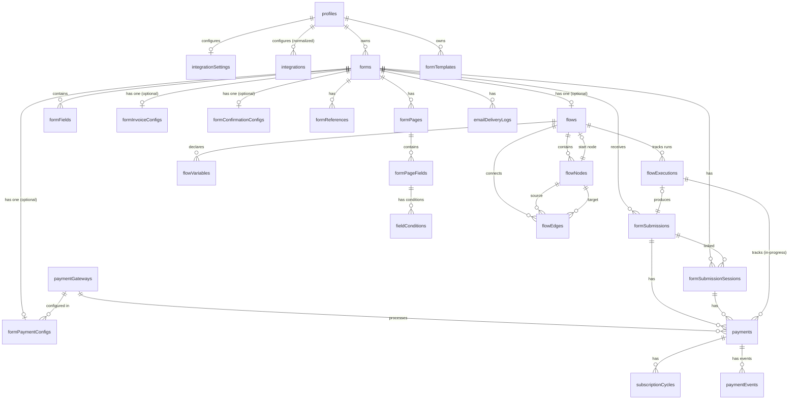

# PonkoForm Database Schema

> Part of [`memory-ponko/`](README.md) — System Memory
> **Verified against:** `src/db/schema.ts` at `7d2cbe3` on 2026-07-28.

---

## 1. Overview

- **Database:** PostgreSQL. The runtime supports Neon HTTP and standard `pg`; driver selection lives in `src/db/driver.ts`.
- **ORM:** Drizzle ORM v0.45
- **Schema location:** `src/db/schema.ts` (880 lines)
- **Migration tool:** Drizzle Kit (`drizzle-kit generate` / `drizzle-kit migrate`)
- **Seed scripts:** `scripts/seed-flow.ts`, `scripts/seed-service-flow.ts`, `scripts/seed-form-templates.ts`
- **Other scripts:** `scripts/migrate.ts`, `scripts/check-schema.ts`, `scripts/prepare-database.ts`, `scripts/reconcile-payments.ts`

---

## 2. Entity Relationship Diagram



---

## 3. All Tables

### 3.1 `profiles`

The user profile. Maps one-to-one with Clerk accounts.

| Column | Type | Notes |
|---|---|---|
| `id` | `serial` PK | |
| `clerk_id` | `text` NOT NULL UNIQUE | Clerk user ID |
| `display_name` | `varchar(255)` | |
| `avatar_url` | `text` | |
| `dashboard_currency` | `varchar(3)` DEFAULT 'USD' NOT NULL | Currency preference |
| `created_at` | `timestamp` DEFAULT now | |

**Indexes:** `unique(profiles_clerk_id_idx)` on `clerk_id`

### 3.1a `integration_settings` (legacy)

Per-user (per-profile) credentials for external services: payment gateways (Xendit, PayPal) and outbound email (SMTP). Each `*_config` column holds an **AES-256-GCM-encrypted JSON blob** (see `src/lib/crypto.ts`) — plaintext secrets are NEVER stored. A `null` column means that integration is not configured for the user.

> **Note:** A new normalized `integrations` table (one row per provider) exists alongside this legacy column-per-provider table. See §3.1b.

| Column | Type | Notes |
|---|---|---|
| `id` | `serial` PK | |
| `profile_id` | `integer` NOT NULL UNIQUE → `profiles.id` (CASCADE) | One row per profile |
| `xendit_config` | `text` | Encrypted JSON; `null` = not configured |
| `paypal_config` | `text` | Encrypted JSON; `null` = not configured |
| `smtp_config` | `text` | Encrypted JSON; `null` = not configured |
| `created_at` | `timestamp` DEFAULT now | |
| `updated_at` | `timestamp` DEFAULT now | |

**Decrypted shapes:**
```
xenditConfig: { secretKey: string, webhookToken?: string }
paypalConfig: { clientId: string, clientSecret: string, mode: 'sandbox' | 'live' }
smtpConfig:   { host: string, port: number, secure: boolean, user: string,
                password: string, fromEmail: string, fromName?: string }
```

### 3.1b `integrations` (new, normalized)

A newer normalized table for per-user provider credentials — one row per `(profile_id, provider)`. Config is stored as AES-256-GCM-encrypted JSON. This coexists with the legacy `integration_settings` table during migration.

| Column | Type | Notes |
|---|---|---|
| `id` | `serial` PK | |
| `profile_id` | `integer` NOT NULL → `profiles.id` (CASCADE) | |
| `provider` | `varchar(50)` NOT NULL | Provider slug (e.g., `xendit`, `paypal`, `smtp`, `google-sheets`) |
| `config` | `text` | Encrypted JSON; `null` = not configured |
| `webhook_endpoint_key` | `varchar(64)` | Unique webhook endpoint key |
| `created_at` | `timestamp` DEFAULT now | |
| `updated_at` | `timestamp` DEFAULT now | |

**Indexes:** `unique(integrations_profile_provider_idx)` on `(profile_id, provider)`, `unique(integrations_webhook_endpoint_key_idx)` on `webhook_endpoint_key`

### 3.2 `forms`

A form created by a user. The current editor uses either Page Builder data or one attached flow; legacy flat fields remain supported by the schema.

| Column | Type | Notes |
|---|---|---|
| `id` | `serial` PK | |
| `profile_id` | `integer` NOT NULL → `profiles.id` (CASCADE) | Owner |
| `title` | `varchar(255)` NOT NULL | |
| `description` | `text` | |
| `status` | `form_status` enum | `'draft'` or `'published'` |
| `public_id` | `varchar(32)` NOT NULL UNIQUE | URL-safe public identifier |
| `theme` | `jsonb` | Per-form theming: `{ primaryColor?, backgroundColor?, radius? }` — see `src/lib/theme.ts` |
| `created_at` | `timestamp` DEFAULT now | |
| `updated_at` | `timestamp` DEFAULT now | |

**Indexes:** `index(forms_profile_id_idx)` on `profile_id`, `unique(forms_public_id_idx)` on `public_id`

### 3.2a `form_invoice_configs`

Per-form invoice/email configuration.

| Column | Type | Notes |
|---|---|---|
| `id` | `serial` PK | |
| `form_id` | `integer` NOT NULL UNIQUE → `forms.id` (CASCADE) | |
| `enabled` | `boolean` DEFAULT false | |
| `respondent_email_field` | `varchar(100)` | Which field holds the respondent's email |
| `subject_template` | `varchar(255)` DEFAULT 'Invoice …' | Template with `{{var}}` |
| `body_template` | `text` | HTML body template |
| `body_template_plain` | `text` | Plain-text fallback |
| `from_name` | `varchar(255)` | Sender name |
| `logo_url` | `text` | Invoice logo URL |
| `accent_color` | `varchar(7)` DEFAULT '#cc785c' | |
| `invoice_prefix` | `varchar(20)` DEFAULT 'INV-' | |
| `invoice_start_number` | `integer` DEFAULT 1000 | |
| `next_invoice_number` | `integer` DEFAULT 1000 | Auto-increments |
| `include_payment_details` | `boolean` DEFAULT true | |
| `include_line_items` | `boolean` DEFAULT false | |
| `line_item_fields` | `jsonb` DEFAULT `[]` | Array of `{label, variable}` |
| `last_test_sent_at` | `timestamp` | |
| `created_at` | `timestamp` DEFAULT now | |
| `updated_at` | `timestamp` DEFAULT now | |

**Indexes:** `unique(form_invoice_configs_form_id_idx)` on `form_id`

### 3.2b `form_confirmation_configs`

Per-form confirmation email settings.

| Column | Type | Notes |
|---|---|---|
| `id` | `serial` PK | |
| `form_id` | `integer` NOT NULL UNIQUE → `forms.id` (CASCADE) | |
| `enabled` | `boolean` DEFAULT false | |
| `respondent_email_field` | `varchar(100)` | |
| `subject_template` | `varchar(255)` DEFAULT 'Thanks for submitting …' | |
| `body_template` | `text` | HTML body template |
| `body_template_plain` | `text` | |
| `from_name` | `varchar(255)` | |
| `last_test_sent_at` | `timestamp` | |
| `created_at` | `timestamp` DEFAULT now | |
| `updated_at` | `timestamp` DEFAULT now | |

**Indexes:** `unique(form_confirmation_configs_form_id_idx)` on `form_id`

### 3.3 `form_fields`

Fields in a linear (non-flow) form.

| Column | Type | Notes |
|---|---|---|
| `id` | `serial` PK | |
| `form_id` | `integer` NOT NULL → `forms.id` (CASCADE) | |
| `type` | `field_type` enum | 18 values — see §5 |
| `label` | `varchar(255)` NOT NULL | |
| `placeholder` | `text` | |
| `required` | `boolean` DEFAULT false | |
| `options` | `jsonb` | Array of `{label, value, emoji?, price?}` for select/checkbox/radio |
| `order` | `integer` NOT NULL DEFAULT 0 | Display order |
| `created_at` | `timestamp` DEFAULT now | |

**Indexes:** `index(form_fields_form_id_order_idx)` on `(form_id, order)`

### 3.4 `form_submissions`

A respondent's submission of a form.

| Column | Type | Notes |
|---|---|---|
| `id` | `serial` PK | |
| `form_id` | `integer` NOT NULL → `forms.id` (CASCADE) | |
| `client_token` | `varchar(64)` | Opaque client token used for idempotency/public ownership checks |
| `status` | `submission_status` enum DEFAULT `'completed'` | `'pending_payment'`, `'incomplete'`, `'completed'`, `'payment_failed'` |
| `form_data` | `jsonb` NOT NULL | All field values; for flow runs, also `__executionPath` |
| `submitted_at` | `timestamp` DEFAULT now | |
| `archived_at` | `timestamp` | Soft-delete timestamp |

**Indexes:** `index(form_submissions_form_id_idx)` on `form_id`, `index(form_submissions_form_archived_idx)` on `(form_id, archived_at)`, `index(form_submissions_form_archived_submitted_idx)` on `(form_id, archived_at, submitted_at)`, `unique(form_submissions_form_client_token_idx)` on `(form_id, client_token)`

### 3.4a `email_survey_invitations`

Tokens for email-based survey invitations with unique access links.

| Column | Type | Notes |
|---|---|---|
| `id` | `serial` PK | |
| `form_id` | `integer` NOT NULL → `forms.id` (CASCADE) | |
| `field_id` | `integer` NOT NULL → `form_page_fields.id` (CASCADE) | Source email field |
| `token_hash` | `varchar(64)` NOT NULL UNIQUE | Hashed access token |
| `recipient_reference` | `varchar(255)` | Human-readable recipient label |
| `form_submission_id` | `integer` → `form_submissions.id` (SET NULL) | Backfilled on submission |
| `expires_at` | `timestamp` NOT NULL | |
| `used_at` | `timestamp` | |
| `created_at` | `timestamp` DEFAULT now | |

**Indexes:** `unique(email_survey_invitations_token_hash_idx)` on `token_hash`, `index` on `form_id` and `field_id`

### 3.4b `form_submission_sessions`

Multi-page submission sessions — tracks in-progress respondent sessions across pages. Supports resume, payment flow, and email survey invitations.

| Column | Type | Notes |
|---|---|---|
| `id` | `serial` PK | |
| `form_id` | `integer` NOT NULL → `forms.id` (CASCADE) | |
| `form_submission_id` | `integer` → `form_submissions.id` (SET NULL) | Backfilled on completion |
| `client_token` | `varchar(64)` | Opaque public session ownership/idempotency token |
| `email_survey_invitation_id` | `integer` → `email_survey_invitations.id` (SET NULL) | |
| `current_page_index` | `integer` DEFAULT 0 | Which page the respondent is on |
| `collected_data` | `jsonb` DEFAULT `{}` | Accumulated field values |
| `status` | `varchar(20)` DEFAULT 'in_progress' | `'in_progress'`, `'payment_pending'`, `'payment_failed'`, `'completed'`, `'cancelled'` |
| `completed_at` | `timestamp` | |
| `created_at` | `timestamp` DEFAULT now | |
| `updated_at` | `timestamp` DEFAULT now | |

**Indexes:** `index` on `form_id`, `unique(form_submission_sessions_form_id_client_token_idx)` on `(form_id, client_token)`, `unique` on `email_survey_invitation_id`

### 3.5 `payment_gateways`

Available payment gateway integrations.

| Column | Type | Notes |
|---|---|---|
| `id` | `serial` PK | |
| `name` | `varchar(100)` NOT NULL | Display name |
| `slug` | `varchar(50)` NOT NULL UNIQUE | Machine name (e.g., `paypal`, `xendit`) |
| `is_active` | `boolean` DEFAULT true | |

### 3.6 `form_payment_configs`

Payment configuration for a specific form.

| Column | Type | Notes |
|---|---|---|
| `id` | `serial` PK | |
| `form_id` | `integer` NOT NULL UNIQUE → `forms.id` (CASCADE) | |
| `payment_gateway_id` | `integer` NOT NULL → `payment_gateways.id` | |
| `amount` | `integer` NOT NULL | Amount in smallest currency unit |
| `currency` | `varchar(3)` DEFAULT 'USD' | |
| `gateway_settings` | `jsonb` | Gateway-specific config |
| `created_at` | `timestamp` DEFAULT now | |

### 3.7 `payments`

Records of individual payment transactions. Supports one-time and subscription payments.

| Column | Type | Notes |
|---|---|---|
| `id` | `serial` PK | |
| `form_submission_id` | `integer` → `form_submissions.id` (SET NULL) | Backfilled at completion |
| `page_session_id` | `integer` → `form_submission_sessions.id` (SET NULL) | For page-builder payments |
| `payment_gateway_id` | `integer` NOT NULL → `payment_gateways.id` | |
| `flow_execution_id` | `integer` → `flow_executions.id` (SET NULL) | Links payment to in-progress flow run |
| `amount` | `integer` NOT NULL | In smallest currency unit |
| `paid_amount` | `integer` | Actual amount paid (may differ) |
| `currency` | `varchar(3)` DEFAULT 'USD' | |
| `payment_kind` | `varchar(20)` DEFAULT 'one_time' | `'one_time'` or `'subscription'` |
| `status` | `payment_status` enum | `'pending'`, `'completed'`, `'failed'`, `'refunded'` |
| `checkout_key` | `varchar(255)` UNIQUE | Internal checkout session key |
| `external_id` | `text` UNIQUE | Gateway's external reference |
| `payment_url` | `text` | Redirect URL for hosted checkout |
| `expires_at` | `timestamp` | Checkout expiry |
| `gateway_payment_id` | `text` UNIQUE | Gateway's payment reference |
| `payment_method` | `text` | Payment method used |
| `payment_channel` | `text` | Payment channel (e.g., GCash, card) |
| `failure_reason` | `text` | Why the payment failed |
| `verification_source` | `varchar(20)` | `'webhook'`, `'return'`, `'reconciliation'`, `'manual'` |
| `gateway_response` | `jsonb` | Full gateway response |
| `paid_at` | `timestamp` | |
| `failed_at` | `timestamp` | |
| `refunded_at` | `timestamp` | |
| `last_verified_at` | `timestamp` | |
| `respondent_name` | `varchar(255)` | Payer name |
| `respondent_email` | `varchar(255)` | Payer email |
| `subscription_plan_id` | `text` UNIQUE | Gateway subscription plan ID |
| `subscription_status` | `varchar(30)` | `'pending'`, `'active'`, `'paused'`, `'past_due'`, `'completed'`, `'cancelled'`, `'deactivated'`, `'failed'` |
| `subscription_checkout_status` | `varchar(30)` | |
| `subscription_interval` | `varchar(10)` | `'WEEK'` or `'MONTH'` |
| `subscription_interval_count` | `integer` | |
| `subscription_max_cycles` | `integer` | |
| `subscription_trial_days` | `integer` | |
| `subscription_anchor_date` | `timestamp` | |
| `subscription_next_charge_at` | `timestamp` | |
| `subscription_ended_at` | `timestamp` | |
| `subscription_last_synced_at` | `timestamp` | |
| `reminder_count` | `integer` DEFAULT 0 | Payment reminder emails sent |
| `last_reminder_at` | `timestamp` | |
| `created_at` | `timestamp` DEFAULT now | |
| `updated_at` | `timestamp` DEFAULT now | |

**Indexes:** `unique` on `gateway_payment_id`, `checkout_key`, `external_id`, `subscription_plan_id`; `index` on `form_submission_id`, `page_session_id`, `flow_execution_id`, `created_at`, `(status, created_at)`, `(subscription_status, subscription_last_synced_at)`

### 3.7a `subscription_cycles`

Individual billing cycles within a subscription payment.

| Column | Type | Notes |
|---|---|---|
| `id` | `serial` PK | |
| `payment_id` | `integer` NOT NULL → `payments.id` (CASCADE) | |
| `gateway_cycle_id` | `text` NOT NULL UNIQUE | Gateway's cycle reference |
| `cycle_number` | `integer` | |
| `status` | `varchar(30)` NOT NULL | `'scheduled'`, `'pending'`, `'retrying'`, `'paid'`, `'failed'`, `'cancelled'`, `'skipped'` |
| `amount` | `integer` NOT NULL | |
| `currency` | `varchar(3)` NOT NULL | |
| `scheduled_at` | `timestamp` | |
| `paid_at` | `timestamp` | |
| `failed_at` | `timestamp` | |
| `failure_code` | `varchar(100)` | |
| `verification_source` | `varchar(20)` | `'webhook'`, `'reconciliation'`, `'manual'` |
| `last_verified_at` | `timestamp` | |
| `created_at` | `timestamp` DEFAULT now | |
| `updated_at` | `timestamp` DEFAULT now | |

**Indexes:** `unique(subscription_cycles_gateway_cycle_id_idx)`, `index` on `(payment_id, scheduled_at)`

### 3.7b `payment_events`

Immutable log of payment webhook/callback events for auditing and reconciliation.

| Column | Type | Notes |
|---|---|---|
| `id` | `serial` PK | |
| `payment_id` | `integer` NOT NULL → `payments.id` (CASCADE) | |
| `event_key` | `varchar(64)` NOT NULL UNIQUE | Idempotency key |
| `gateway_event_id` | `text` | Gateway's event ID |
| `event_type` | `varchar(80)` NOT NULL | E.g., `payment.succeeded` |
| `provider_status` | `varchar(40)` | Raw gateway status |
| `normalized_status` | `payment_status` enum | Mapped to internal enum |
| `source` | `varchar(20)` NOT NULL | `'webhook'`, `'return'`, `'reconciliation'`, `'manual'` |
| `payload` | `jsonb` | Full event payload |
| `processing_status` | `varchar(20)` DEFAULT 'processed' | `'processing'`, `'processed'`, `'ignored'`, `'failed'` |
| `error` | `text` | Processing error if any |
| `received_at` | `timestamp` DEFAULT now | |
| `processed_at` | `timestamp` | |

**Indexes:** `unique(payment_events_event_key_idx)`, `index` on `(payment_id, received_at)`

### 3.7c `email_delivery_logs`

Tracks email delivery (invoices, confirmations) per submission.

| Column | Type | Notes |
|---|---|---|
| `id` | `serial` PK | |
| `form_id` | `integer` NOT NULL → `forms.id` (CASCADE) | |
| `form_submission_id` | `integer` NOT NULL → `form_submissions.id` (CASCADE) | |
| `payment_id` | `integer` → `payments.id` (SET NULL) | |
| `template_kind` | `varchar(20)` NOT NULL | `'invoice'` or `'confirmation'` |
| `recipient_email` | `varchar(255)` NOT NULL | |
| `invoice_number` | `varchar(50)` | |
| `subject` | `varchar(255)` NOT NULL | |
| `template_snapshot` | `jsonb` NOT NULL | Frozen template at send time |
| `status` | `varchar(20)` DEFAULT 'queued' | `'queued'`, `'sending'`, `'sent'`, `'failed'` |
| `provider` | `varchar(20)` | SMTP provider used |
| `message_id` | `varchar(255)` | Provider's message ID |
| `error_message` | `text` | |
| `attempt_count` | `integer` DEFAULT 0 | |
| `last_attempt_at` | `timestamp` | |
| `sent_at` | `timestamp` | |
| `created_at` | `timestamp` DEFAULT now | |
| `updated_at` | `timestamp` DEFAULT now | |

**Indexes:** `unique` on `(form_submission_id, template_kind)`, `unique` on `(form_id, invoice_number)`, `index` on `(form_id, created_at)`, `status`, `payment_id`

---

## 4. Page Builder Tables (FT-007)

### 4.1 `form_references`

Named references (variables) scoped to a form — used for computations, pricing lookups, and template interpolations in the page builder.

| Column | Type | Notes |
|---|---|---|
| `id` | `serial` PK | |
| `form_id` | `integer` NOT NULL → `forms.id` (CASCADE) | |
| `key` | `varchar(100)` NOT NULL | Unique reference key |
| `type` | `varchar(20)` NOT NULL | `'number'`, `'percentage'`, `'text'`, `'boolean'` |
| `value` | `text` NOT NULL | Stored value |
| `label` | `varchar(255)` | |
| `description` | `text` | |
| `position` | `integer` DEFAULT 0 | |
| `created_at` | `timestamp` DEFAULT now | |
| `updated_at` | `timestamp` DEFAULT now | |

**Indexes:** `unique(form_references_form_id_key_idx)` on `(form_id, key)`, `index` on `(form_id, position)`

### 4.2 `form_pages`

Multi-page form definitions (replaces/supplements linear mode).

| Column | Type | Notes |
|---|---|---|
| `id` | `serial` PK | |
| `form_id` | `integer` NOT NULL → `forms.id` (CASCADE) | |
| `title` | `varchar(255)` NOT NULL | |
| `description` | `text` | |
| `position` | `integer` DEFAULT 0 | Page order |
| `is_final` | `boolean` DEFAULT false | Final/thank-you page |
| `final_template` | `text` | Thank-you page template |
| `final_redirect_url` | `varchar(500)` | Post-submit redirect |
| `has_payment` | `boolean` DEFAULT false | |
| `payment_gateway_id` | `integer` → `payment_gateways.id` | |
| `payment_amount_variable` | `varchar(100)` | |
| `payment_currency` | `varchar(3)` DEFAULT 'USD' | |
| `payment_computation` | `jsonb` | `{ mode, fieldBindings?, fixedAmount?, adjustments?, showBreakdown? }` |
| `subscription_config` | `jsonb` | Subscription settings |
| `created_at` | `timestamp` DEFAULT now | |
| `updated_at` | `timestamp` DEFAULT now | |

**Indexes:** `index(form_pages_form_id_position_idx)` on `(form_id, position)`

### 4.3 `form_page_fields`

Fields within a page builder page. Supports conditional logic, validation rules, price options, and width control.

| Column | Type | Notes |
|---|---|---|
| `id` | `serial` PK | |
| `page_id` | `integer` NOT NULL → `form_pages.id` (CASCADE) | |
| `field_type` | `field_type` enum | 18 values |
| `label` | `varchar(255)` NOT NULL | |
| `placeholder` | `varchar(255)` | |
| `required` | `boolean` DEFAULT false | |
| `options` | `jsonb` | Array with `{label, value, emoji?, price?, priceReference?, additionalPrice?, additionalPriceReference?}` |
| `bind_variable` | `varchar(100)` NOT NULL | |
| `position` | `integer` DEFAULT 0 | |
| `width` | `varchar(20)` DEFAULT 'full' | `'full'` or `'half'` |
| `validation_rules` | `jsonb` | `{ allowedCharacters?, customPattern?, minLength?, maxLength?, minValue?, maxValue?, message?, optionPricesEnabled?, addressRequired?, uploadAccept?, uploadAcceptCustom?, uploadMultiple? }` |
| `created_at` | `timestamp` DEFAULT now | |
| `updated_at` | `timestamp` DEFAULT now | |

**Indexes:** `index(form_page_fields_page_id_position_idx)` on `(page_id, position)`

### 4.4 `field_conditions`

Conditional show/hide rules for page builder fields.

| Column | Type | Notes |
|---|---|---|
| `id` | `serial` PK | |
| `field_id` | `integer` NOT NULL → `form_page_fields.id` (CASCADE) | Target field |
| `source_field_binding` | `varchar(100)` NOT NULL | Source variable to check |
| `operator` | `varchar(20)` NOT NULL | `'equals'`, `'not_equals'`, `'contains'`, `'greater_than'`, `'less_than'`, `'is_empty'`, `'is_not_empty'` |
| `value` | `text` | Value to compare against |
| `action` | `varchar(20)` DEFAULT 'show' | `'show'` or `'hide'` |
| `created_at` | `timestamp` DEFAULT now | |

**Indexes:** `index(field_conditions_field_id_idx)` on `field_id`

### 4.5 `form_templates`

Reusable form/page templates (built-in + user-created).

| Column | Type | Notes |
|---|---|---|
| `id` | `serial` PK | |
| `profile_id` | `integer` → `profiles.id` (CASCADE) | Owner (null for built-in) |
| `name` | `varchar(255)` NOT NULL | |
| `description` | `text` | |
| `category` | `varchar(50)` DEFAULT 'general' | |
| `pages_data` | `jsonb` DEFAULT `[]` | Array of `TemplatePageData` |
| `is_builtin` | `boolean` DEFAULT false | |
| `usage_count` | `integer` DEFAULT 0 | |
| `created_at` | `timestamp` DEFAULT now | |
| `updated_at` | `timestamp` DEFAULT now | |

**Indexes:** `index` on `profile_id` and `category`, `unique` on `(is_builtin, name)`

---

## 5. Flow Builder Tables

### 5.1 `flows`

Links a flow definition to a form.

| Column | Type | Notes |
|---|---|---|
| `id` | `serial` PK | |
| `form_id` | `integer` NOT NULL UNIQUE → `forms.id` (CASCADE) | One flow per form |
| `start_node_id` | `integer` → `flow_nodes.id` | Set after node creation |
| `created_at` | `timestamp` DEFAULT now | |
| `updated_at` | `timestamp` DEFAULT now | |

**Indexes:** `index(flows_form_id_idx)` on `form_id`

### 5.2 `flow_variables`

Typed variable declarations scoped to a flow.

| Column | Type | Notes |
|---|---|---|
| `id` | `serial` PK | |
| `flow_id` | `integer` NOT NULL → `flows.id` (CASCADE) | |
| `name` | `varchar(100)` NOT NULL | `snake_case` identifier |
| `type` | `varchar(20)` NOT NULL | `'string'`, `'number'`, `'boolean'`, `'money'`, `'date'`, `'time'`, `'datetime'` |
| `default_value` | `text` | Stored as string, parsed by type |
| `description` | `text` | Human-readable note |
| `created_at` | `timestamp` DEFAULT now | |

**Indexes:** `unique(flow_variables_flow_id_name_idx)` on `(flow_id, name)`

### 5.3 `flow_nodes`

Each node in the flow graph. The `config` JSONB holds type-specific configuration.

| Column | Type | Notes |
|---|---|---|
| `id` | `serial` PK | |
| `flow_id` | `integer` NOT NULL → `flows.id` (CASCADE) | |
| `type` | `varchar(30)` NOT NULL | `'start'`, `'form_field'`, `'group'`, `'decision'`, `'calculator'`, `'payment'`, `'summary'`, `'redirect'` |
| `label` | `varchar(255)` | Display label |
| `config` | `jsonb` NOT NULL DEFAULT `{}` | Type-specific config (see below) |
| `positionX` | `integer` NOT NULL DEFAULT 0 | Canvas X position |
| `positionY` | `integer` NOT NULL DEFAULT 0 | Canvas Y position |
| `created_at` | `timestamp` DEFAULT now | |

**Indexes:** `index(flow_nodes_flow_id_idx)` on `flow_id`

#### `config` Shapes by Node Type

**`form_field`:**
```json
{
  "fieldType": "text|email|number|textarea|select|checkbox|radio",
  "label": "Field Label",
  "placeholder": "Optional placeholder",
  "required": true,
  "options": [{"label": "Option 1", "value": "opt1"}],
  "bindToVariable": "variable_name"
}
```

**`group`:**
```json
{
  "title": "Group Title",
  "fields": [
    { "id": "unique-id", "label": "Field 1", "fieldType": "text", "required": true, "options": [] }
  ]
}
```

**`decision`:**
```json
{
  "sourceVariable": "variable_name",
  "branches": [{"value": "option_value", "label": "Display Label"}]
}
```

**`calculator`:**
```json
{
  "targetVariable": "result_variable",
  "expression": "{{var1}} * 1.12",
  "label": "Human-readable label"
}
```

**`payment`:**
```json
{
  "amountVariable": "total_cost",
  "currency": "PHP",
  "gatewayId": 1,
  "label": "Pay Now"
}
```

**`summary`:**
```json
{
  "title": "Thank You",
  "template": "Your total is {{total_cost}}"
}
```

**`redirect`:**
```json
{
  "urlTemplate": "https://example.com/ref={{payment_ref}}"
}
```

### 5.4 `flow_edges`

Directed connections between nodes.

| Column | Type | Notes |
|---|---|---|
| `id` | `serial` PK | |
| `flow_id` | `integer` NOT NULL → `flows.id` (CASCADE) | |
| `source_node_id` | `integer` NOT NULL → `flow_nodes.id` (CASCADE) | |
| `target_node_id` | `integer` NOT NULL → `flow_nodes.id` (CASCADE) | |
| `metadata` | `jsonb` DEFAULT `{}` | `{ matchValue?: string, label?: string }` |
| `created_at` | `timestamp` DEFAULT now | |

**Indexes:** `index(flow_edges_flow_id_idx)` on `flow_id`

For Decision nodes, each edge's `metadata.matchValue` determines which branch fires.

### 5.5 `flow_executions`

Records a single run of a flow by a respondent.

| Column | Type | Notes |
|---|---|---|
| `id` | `serial` PK | |
| `flow_id` | `integer` NOT NULL → `flows.id` (CASCADE) | |
| `form_submission_id` | `integer` → `form_submissions.id` (SET NULL) | Created on completion |
| `status` | `varchar(20)` NOT NULL DEFAULT `'in_progress'` | `'in_progress'`, `'completed'`, `'payment_pending'`, `'payment_failed'`, `'cancelled'` |
| `current_node_id` | `integer` → `flow_nodes.id` | Current position in flow |
| `variables` | `jsonb` DEFAULT `{}` | Live variable values during execution |
| `history` | `jsonb` DEFAULT `[]` | Array of `{nodeId, nodeType, enteredAt, data?}` |
| `completed_at` | `timestamp` | |
| `created_at` | `timestamp` DEFAULT now | |

**Indexes:** `index(flow_executions_flow_id_idx)` on `flow_id`, `unique(flow_executions_client_token_idx)` on `client_token`

---

## 6. Enums (Postgres)

Defined in `src/db/schema.ts` via `pgEnum`:

| Enum Name | Values |
|---|---|
| `form_status` | `'draft'`, `'published'` |
| `field_type` | `'text'`, `'email'`, `'number'`, `'textarea'`, `'select'`, `'checkbox'`, `'radio'`, `'payment'`, `'date'`, `'time'`, `'datetime'`, `'content'`, `'media'`, `'address'`, `'computation'`, `'file_upload'`, `'satisfaction'`, `'recaptcha'` |
| `payment_status` | `'pending'`, `'completed'`, `'failed'`, `'refunded'` |
| `submission_status` | `'pending_payment'`, `'incomplete'`, `'completed'`, `'payment_failed'` |
| `flow_node_type` | (varchar — not a pg enum; uses `.$type<>()` in Drizzle for type safety) |

---

## 7. Migration & Seed Workflow

```bash
# Generate a new migration after schema changes
pnpm run db:generate

# Apply migrations
pnpm run db:migrate

# Push schema directly (dev only — no migration file)
pnpm run db:push

# Pull schema from DB (introspect)
pnpm run db:pull

# Open Drizzle Studio GUI
pnpm run db:studio

# Prepare + check + seed templates (used in build/deploy pipeline)
pnpm run db:prepare

# Seed sample flows
pnpm run db:seed-flow            # Payment Plan flow
pnpm run db:seed-service-flow    # Service Order flow
pnpm run db:seed-form-templates  # Built-in form templates

# Payment reconciliation
pnpm run payments:reconcile
```

---

## 8. Important Notes

- **Money is stored as integers** in the smallest currency unit (e.g., `1500000` = ₱15,000.00). Never use floats for money.
- **Per-form theming** is stored in `forms.theme` as a JSONB column (`{ primaryColor?, backgroundColor?, radius: 'sharp'|'rounded'|'pill' }`). CSS custom properties are generated by `src/lib/theme.ts` (`themeVars()`).
- **Flows have cascade deletes** — deleting a flow removes its nodes, edges, variables, and executions.
- **Forms with a flow** still save submissions to `form_submissions` with all variable values in `form_data`.
- The `varchar` enums (like `flow_nodes.type`) use `.$type<>()` in Drizzle for compile-time safety without creating database enum types.
- Drizzle camelCase column names (`positionX`, `sourceNodeId`, `formSubmissionId`) auto-map to snake_case in PostgreSQL (`position_x`, `source_node_id`, `form_submission_id`).
- **Two integrations tables** coexist: `integration_settings` (legacy, column-per-provider) and `integrations` (new, normalized one-row-per-provider). See `src/lib/server-fns/integrations.ts`.
- Treat `src/db/schema.ts` as authoritative for columns and indexes. Update this document in the same change as a schema migration.
